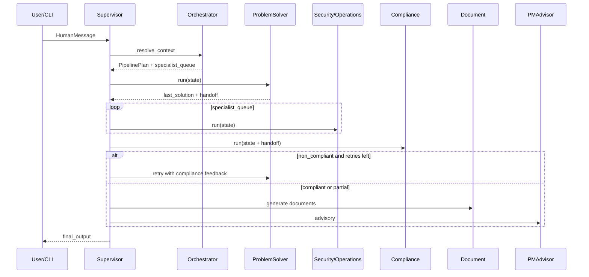

# Forge 架构文档（Project AI OS）

> 版本：2026-06-rev4 | 代码基线：**v1.0 已交付** → v1.1 打磨中  
> 本文档分两部分：**§A v1.0 施工范围**（现在做什么）与 **§B North Star**（长期方向，不纳入 v1.0 交付）。  
> **§A 为当前施工单一事实来源**；实现以 `tests/` 与 `README.md` 为准。

---

## 文档怎么用

| 读者意图 | 读哪一节 |
|----------|----------|
| 现在要写什么代码、什么不做 | **§A** 全文 |
| **具体任务、工期、验收怎么执行** | [`IMPLEMENTATION_PLAN.md`](IMPLEMENTATION_PLAN.md) |
| 当前代码离 v1.0 还差什么 | **§A.4**（含代码基线映射） |
| 半年后的演进方向 | **§B**（参考，不排进当前 sprint） |
| 评审是否过度设计 | 对照 §A「v1.0 明确不做」 |

**核心原则**：v1.0 追求 **能用 + 好用 + 可演示**；优雅抽象在闭环质量达标之后再引入。

---

# §A — v1.0 施工范围

## A.1 v1.0 目标与验收

### 一句话目标

> **v1.0 目标**：在系统集成场景下，让「问题诊断与方案生成 → 多标准合规检查 → 实用资料生成 → 项目经理决策支持」这一核心闭环稳定跑通，并具备清晰的扩展接口与可审计的代码质量。

### 验收标准（Done 的定义）

| # | 标准 | 可验证方式 |
|---|------|------------|
| 1 | 无 API Key 时启发式路径可走通标准闭环 | `pytest` 全绿 |
| 2 | 有 API Key 时 ProblemSolver 稳定引用 Rule Pack | `rule_pack_references` 非空；见 M2 量化指标 |
| 3 | Compliance 可解释、可配置严格度 | 检查项 ↔ `rule_id` 可对应；`check_mode` 三种模式可用 |
| 4 | Document 产出实用交付物 | ≥2 类 Markdown（方案摘要、整改记录、测评/变更记录类） |
| 5 | CLI Demo 可演示 | `--type`、save/load、思考链路、合规重试 |
| 6 | 模块边界可审计 | agents 无互引；tools 无 agents 依赖；6 Agent 均经 ToolRegistry |

### M2 量化指标（闭环质量）

- **ProblemSolver `rule_pack_references` 覆盖率 ≥ 70%**（在标准场景测试集上：等保 / ITIL / 混合各 ≥1 例，有 LLM 时统计）。
- **Compliance 检查项 `rule_id` 映射率 ≥ 80%**（启发式路径亦应尽量带 `rule_id`）。

### v1.0 明确不做

| 不做 | 理由 |
|------|------|
| **AgentRegistry** | workflow 硬编码在 v1.0 可接受；注册表增加复杂度，M2 之后再评估 |
| SkillRegistry / `capabilities/` | Agent 能力未打透前，Skill 是空中楼阁 |
| 独立 `memory/` 子系统、向量检索 | `knowledge_base` + 标签检索足够 |
| WorkflowDefinition JSON/YAML | workflow 未稳定，数据驱动增加调试成本 |
| Web 增强（resume、SSE、角色视图） | v1.0 **仅维持** `POST /solve` 雏形，不投入 |
| `main.py` 全面重构为多命令 CLI 框架 | 可做瘦身，但不阻塞 v1.0 |
| Docker / 多租户 / 外部系统实时集成 | v1.1+ |
| Agent 自主修改生产配置 | 永久红线（见 A.2） |

---

## A.2 人机协作边界（v1.0 必须遵守）

Forge v1.0 是 **「强辅助 + 人类最终确认」**，不是半自治执行引擎。

| 层级 | v1.0 行为 |
|------|-----------|
| **可自主** | 问题诊断、检索 Rule Pack、生成方案草稿、合规检查报告、文档草稿、PM 建议 |
| **需人确认** | 正式交付物定稿、合规结论对外提交、任何生产变更建议的执行 |
| **禁止** | 无规则约束下自动改生产配置；绕过 Compliance 直接标记「可交付」 |

v2.0 再评估是否在规则框架内放开**部分**可审计的自动执行（如工单草稿、CI 触发），v1.0 不讨论。

---

## A.3 Forge 差异化（v1.0）

差异化来自 **三件套组合**，而非单独的「记忆」或「Skill」：

1. **项目级持久状态** — `ProjectState` + JSON 持久化
2. **多标准可执行 Rule Pack** — 等保 / ITIL / 系统集成规则驱动检查与方案引用
3. **多 Agent 协作闭环** — handoff、专家链、合规重试、思考链路

与 net-ops：**借鉴** BaseAgent、ToolRegistry、模块边界；**不照搬** Skill。Forge 场景更宽，Skill 在能力重复出现后再抽取。

| 维度 | net-ops（借鉴） | Forge v1.0（做实） |
|------|----------------|-------------------|
| Agent 契约 | 统一 Base | `core/base_agent.py` ✅ |
| 工具管理 | Tool Registry | 6 Agent 全部接入 `tool_registry.py` |
| 编排 | 清晰流水线 | Supervisor + Orchestrator + LangGraph |
| Skill | 有 | **不做** |
| 记忆 | 会话为主 | `knowledge_base` + 标签检索 |
| 规则 | 运维剧本 | Rule Pack + 合规闭环 |

---

## A.4 当前进度与代码基线

### 进度条（目标完成度，非代码行数）

```
v1.0 交付（M1–M3 + 签收）        ████████████████████  100%
v1.1 打磨（Demo 稳定性 / 文档）   ████░░░░░░░░░░░░░░░░  ~20%
距 North Star 完整愿景           ██████░░░░░░░░░░░░░░  ~30%
```

### 当前真实状态（2026-06-06，v1.0 交付后）

| 模块 | 文件 | 状态 |
|------|------|------|
| ProblemSolver | `agents/problem_solver.py` | ✅ ToolRegistry + 引用率 ≥70%（离线 + LLM 测试） |
| Compliance | `agents/compliance.py` | ✅ `check_mode` 三模式 + rule_id ≥80% |
| Security / Operations / PMAdvisor | `agents/*.py` | ✅ Registry + `run_react` |
| Document | `agents/document.py` | ✅ 7 份 Markdown 模板 bundle |
| ToolRegistry | `core/tool_registry.py` | ✅ 6/6 |
| CLI | `cli/` + `main.py` (~255 行) | ✅ scenarios / parser / runner / `--report` / `--demo-seed` |
| Web | `web/app.py` | ✅ `POST /solve` + check_mode / demo_seed（v1.0 维持级） |
| 测试 | `tests/` | ✅ 115+ 离线；`@pytest.mark.llm` 引用率验收 |
| Prompts | `prompts/<agent>/prompts.py` | ✅ 正文已迁入子目录；`*_prompt.py` 为 legacy 重导出 |

### 已具备（不必重复建设）

- LangGraph 标准闭环与合规重试 ≤2
- `BaseAgent`、`PipelineOrchestrator`、`Supervisor`
- Rule Pack 加载、多厂商 LLM、离线降级
- `agent_context` handoff、`conversation_history`、`pipeline_trace`
- Rich CLI、JSON 状态持久化

### v1.1 候选（v1.0 已交付，按优先级）

| 优先级 | 工作项 |
|--------|--------|
| **P1** | Web resume / SSE / 角色视图 |
| **P1** | Docker / 部署文档 |
| **P2** | AgentRegistry（workflow 数据驱动） |
| **P2** | 向量记忆 / 外部系统集成 |
| **延后** | SkillRegistry、自主执行生产变更 |

---

## A.5 v1.0 分层架构

```
┌──────────────────────────────────────────────────────────────┐
│  cli/  +  main.py（入口，v1.0 逐步瘦身）                       │
│  web/app.py（API 雏形 — v1.0 仅维持，不重点投入）                │
└────────────────────────────┬─────────────────────────────────┘
                             │ 只调 core 公开 API（run_forge / workflow）
┌────────────────────────────▼─────────────────────────────────┐
│  core/  运行时内核                                            │
│    Supervisor → PipelineOrchestrator → workflow (LangGraph)  │
│    ProjectState · PipelinePlan · base_agent · tool_registry  │
└────────────────────────────┬─────────────────────────────────┘
                             │
┌────────────────────────────▼─────────────────────────────────┐
│  agents/  六领域 Agent（薄编排，继承 BaseAgent）              │
└────────────────────────────┬─────────────────────────────────┘
                             │
┌────────────────────────────▼─────────────────────────────────┐
│  tools/ · prompts/{agent}/ · utils/ · config                  │
└────────────────────────────┬─────────────────────────────────┘
                             │
┌────────────────────────────▼─────────────────────────────────┐
│  rule_packs/ · .forge_state/                                 │
└──────────────────────────────────────────────────────────────┘
```

**v1.0 不引入**：`capabilities/`、`memory/`、`interfaces/` 包、`agent_registry.py`。

### 依赖规则（强制执行）

1. `agents/` 之间 **禁止** 互相 import。
2. `tools/` 只依赖 `core.state` / `core.rule_pack`，**禁止** import `agents/`。
3. `web/`、`main.py` 经 `run_forge` / `compile_workflow` 进入内核。
4. 跨 Agent 数据只走 `ProjectState` + `agent_context` handoff。
5. 工具 **必须** `ToolRegistry.register`；Agent **必须** `self.get_tools(state)`。

### ProjectState 逻辑分区（v1.0 不拆文件）

```
ProjectState
├── identity      project_id, run_id, enabled_modules
├── workflow      active_workflow, workflow_plan, specialist_queue
├── artifacts     last_solution, last_compliance_result, generated_documents, ...
├── recall        knowledge_base, conversation_history
├── tasks         pending_tasks, wbs_snapshot
└── meta          agent_errors, pipeline_trace, timings
```

**记忆**：`utils/knowledge.py` 提供 `append_knowledge` / `search_knowledge(tags=, agent=)`，**不**建 `memory/` 包。

---

## A.6 核心模块（v1.0 边界）

### BaseAgent — ✅ 保持

统一 `run()` → ReAct（可选）→ structured → heuristic → 写回 state。

### ToolRegistry — 🔄 M1 必须完成

v1.0 **必须**覆盖以下 6 个 Agent（`name` 与注册键一致）：

| 注册键 | Agent | 工具构建函数 | Registry 状态 |
|--------|-------|-------------|---------------|
| `problem_solver` | ProblemSolverAgent | `build_problem_solver_tools` | ✅ 已接入 |
| `compliance` | ComplianceAgent | `build_compliance_tools` | ✅ 已接入 |
| `security` | SecurityAgent | `build_security_tools` | ❌ 待接入 |
| `operations` | OperationsAgent | `build_operations_tools` | ❌ 待接入 |
| `document` | DocumentAgent | `build_document_tools`（或等价） | ❌ 待接入 |
| `pm_advisor` | PMAdvisorAgent | `build_pm_advisor_tools` | ❌ 待接入 |

### AgentRegistry — ❌ v1.0 不做

`workflow.py` 继续显式装配节点；待流水线稳定且 Agent 数量显著增加后再评估。

### Orchestrator + Supervisor — ✅ 保持

问题分类 → specialist_queue → 合规重试；v1.0 不做外置 WorkflowDefinition。

### Rule Pack — ✅ 加深使用

Compliance / ProblemSolver 输出须能追溯到 `rule_id`；热加载延后。

### LLM 网关 — ✅ 保持

v1.0 可选：在 `pipeline_trace` 记录 model / latency。

---

## A.7 标准执行流



---

## A.8 v1.0 目录结构

**当前**（Batch 3 之前）与 **目标**（M1 结束时）：

```
forge/
├── core/
│   ├── base_agent.py
│   ├── tool_registry.py          # 6 Agent 全注册
│   ├── orchestrator.py
│   ├── supervisor.py
│   ├── workflow.py               # v1.0 硬编码，无 agent_registry
│   ├── state.py
│   ├── pipeline.py
│   └── rule_pack*.py
├── agents/
├── tools/
├── prompts/
│   ├── problem_solver/           # M1：从平铺 *_prompt.py 迁入
│   ├── compliance/
│   ├── security/
│   ├── operations/
│   ├── document/
│   └── pm_advisor/
├── cli/                          # M3：从 main.py 迁出子命令/场景脚本
│   └── display.py
├── utils/
│   ├── llm.py
│   ├── knowledge.py              # Batch 3.5：标签检索 helper
│   └── ...
├── config.py
└── main.py                       # 保持薄入口，逻辑逐步下沉 cli/

web/                              # v1.0 仅维持，不增强
rule_packs/
tests/
docs/
```

**prompts 迁移策略**：M1 合并 legacy 双份文件；按 Agent 分子目录，每目录保留 `system.py`、`react.py`、`structured.py`（或单文件 `prompts.py`），避免根目录平铺过多文件。

---

## A.9 v1.0 路线图（M1 → M3）

### M1 — 架构收口（当前）

- [x] BaseAgent、Orchestrator、Supervisor
- [x] ToolRegistry（problem_solver, compliance）
- [x] ToolRegistry **6/6**
- [x] 消除 security / operations / pm_advisor 内直接 `build_*_tools`
- [x] prompts：正文在 `prompts/<agent>/prompts.py`；`*_prompt.py` legacy 重导出
- [x] **不做** AgentRegistry

### M2 — 闭环质量（v1.0 核心）

- [x] ProblemSolver 引用率 ≥70%（启发式 `test_metrics.py`；LLM `test_llm_reference_coverage.py` + `make test-llm`）
- [x] Compliance **`check_mode`** 骨架 + 状态映射逻辑
- [x] Compliance **rule_id 映射率 ≥ 80%**（启发式路径，`test_metrics.py`）
- [x] Document **三类+** Markdown 模板（summary / plan / record + 原有）
- [x] `utils/knowledge.py` + ProblemSolver 接入标签案例检索
- [x] 单次运行 Markdown 报告（`--report` / `utils/run_report.py`）

### M3 — Demo 说服力（v1.0 交付）

- [x] CLI 场景：`cli/scenarios.py` + `make demo-mixed`
- [x] `cli/parser.py` + `cli/scenarios.py` + `runner`/`resolvers`/`result_print`；`main.py` ~255 行
- [x] **Rich Demo 故事板**（`cli/demo_display.py`）：思考链路、合规重试、Handoff、统计
- [x] README 与本文档对齐
- [x] 集成测试：无 LLM 全闭环 + `@pytest.mark.llm` 引用率 job

**v1.0 完成标志**：M1 + M2 + M3 全部勾选，且 §A.1 验收表 6 条满足。✅ **已达成（2026-06-06）**

### M4 — v1.1 半自治（2026-06-06）

- [x] `AgentRegistry` — `core/agent_registry.py`
- [x] `ConfidenceScorer` — `core/confidence/`
- [x] Execution Layer — `core/execution/`（任务草稿，不对接真实系统）
- [x] ApprovalFlow — `core/approval/` + CLI `--auto-approve` / `--approve` / `--reject`
- [x] 知识沉淀 — `utils/knowledge_extract.py`；`kb` CLI；`core/memory/graph.py` stub

---

## A.10 接口契约

### Agent 输出

继承 `AgentOutputBase`：`to_state_dict()` / `to_display_json()`。

### Handoff（agent_context）

```json
{
  "from_agent": "problem_solver",
  "to_agent": "compliance",
  "payload": {
    "solution_id": "sol-001",
    "rule_pack_references": ["dengbao_2.0:R-012"],
    "problem_type": "security"
  }
}
```

### 新增 Agent 检查清单

1. `agents/foo.py` — BaseAgent + `run()`
2. `tools/foo_tools.py` — `build_foo_tools(state)`，无 agents 依赖
3. `ToolRegistry.register("foo", build_foo_tools)`
4. `prompts/foo/` — SYSTEM / REACT / STRUCTURED
5. `workflow.py` + Orchestrator（如需要）
6. `tests/test_foo.py` — 离线可测

---

## A.11 质量门禁

| 门禁 | v1.0 标准 |
|------|-----------|
| 测试 | 新行为有离线测试；`pytest` 全绿 |
| 耦合 | agents 无互引；tools 无 agents 依赖；6 Agent 经 Registry |
| 降级 | 无 Key 时闭环可走通 |
| 量化 | M2 引用率 / rule_id 映射率达标 |
| 演示 | ≥3 个场景可一键重复演示 |
| 文档 | 变更同步本文档 §A |

---

## A.12 代码任务批次

### Batch 3 — 架构收口

1. ToolRegistry **6/6**
2. 耦合清理：Agent 统一 `self.get_tools()` / `self.run_react()`
3. prompts legacy 合并（可先平铺，M1 内完成分子目录）
4. Compliance `check_mode` 骨架（strict / advisory / lenient 枚举 + state 字段）

**不在 Batch 3**：AgentRegistry、Skill、memory 包、Web、YAML workflow。

### Batch 3.5 — 闭环打磨（Batch 3 之后）

1. ProblemSolver Prompt 调优 + 标准场景测试集（等保 / ITIL / 混合）
2. Compliance `check_mode` 完整行为 + 检查项 `rule_id` 映射
3. Document 三类 Markdown 模板
4. `utils/knowledge.py` + ProblemSolver 接入 `search_knowledge` 案例上下文
5. 引用率 / 映射率测试用例（对齐 M2 量化指标）

### Batch 4 — Demo 与交付（M3）

1. `cli/scenarios/` 或 Makefile demo 目标
2. `main.py` 瘦身
3. 运行报告 Markdown 导出

---

# §B — North Star（长期方向，非 v1.0）

> **不得作为当前 sprint 交付承诺。** 仅用于预留扩展点。

## B.1 一句话愿景

> Forge 成为复杂交付项目（系统集成、数字化转型等）的 AI 执行层：通过**持久项目记忆 + 可执行多标准规则 + 多 Agent 协作**，在人工监督下持续降低执行成本与合规风险，并逐步积累组织级项目智能资产。

## B.2 v1.1+ 可能引入的能力

| 能力 | 触发条件 |
|------|----------|
| AgentRegistry | workflow 稳定且 Agent 数量/变体显著增加 |
| Skill 组合层 | 同一 Agent+Tool+Prompt 模式重复 ≥3 次 |
| 语义记忆（vector_store） | 标签检索不足以支撑案例复用 |
| `memory/` 独立包 | 记忆逻辑 >300 行或需多 backend |
| WorkflowDefinition 外置 | 流水线 ≥3 个月无结构性变更 |
| Rule Pack 热加载 | 企业自定义 Pack 需求明确 |
| Web 产品化 | CLI Demo 验证价值后 |
| Docker / CI | 对外交付或多环境部署 |
| 外部集成适配器 | 单点需求明确（CMDB / 监控） |

## B.3 长期分层（简化）

```
CLI / Web / SDK
      ↓
Supervisor · Orchestrator · Workflow
      ↓
agents  (+ 未来 capabilities/ · memory/)
      ↓
tools · prompts · llm · rule_packs
```

## B.4 永久红线

- Agent 在无规则约束下修改生产环境
- 绕过 Compliance 输出「正式可交付」结论
- 多租户 / 权限在未设计前对客承诺

---

## 修订记录

| 版本 | 日期 | 变更 |
|------|------|------|
| rev1 | 2026-06 | 初版目标架构 |
| rev2 | 2026-06 | 拆 §A/§B；收窄 v1.0；人机边界 |
| rev3 | 2026-06-06 | 锋利目标表述；**代码基线映射表**；AgentRegistry 明确不做；ToolRegistry 6 Agent 清单；M2 量化指标；Batch 3.5；收敛 §B；cli/prompts 目录目标 |
