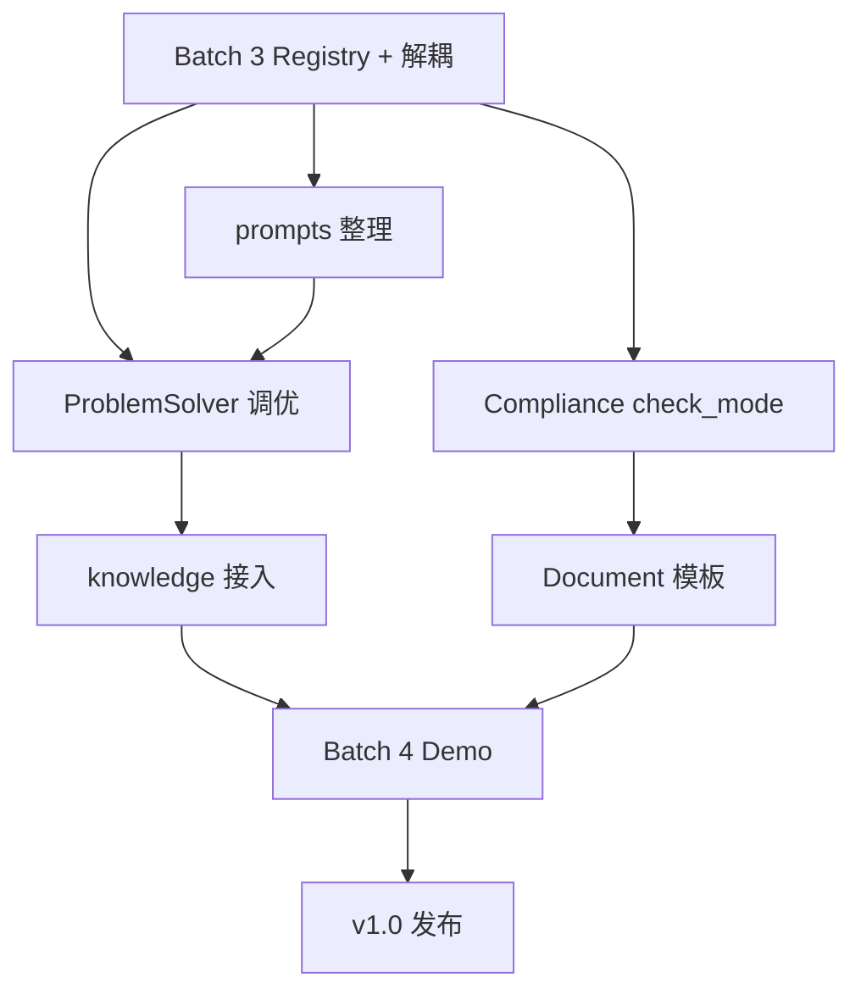

# Forge v1.0 实施计划

> 版本：2026-06-06 | 对齐文档：[`ARCHITECTURE.md`](ARCHITECTURE.md) rev3  
> 范围：从当前代码基线（v0.1）交付 **v1.0 可演示、可测试、可扩展** 的闭环产品  
> 原则：**先闭环质量，后优雅抽象**；v1.0 不做 AgentRegistry、Skill、memory 包、Web 增强

---

## 1. 目标与完成定义

### 1.1 v1.0 交付物

| 交付物 | 说明 |
|--------|------|
| 稳定闭环 | 问题诊断 → 合规 → 资料 → PM 建议，离线/在线均可跑通 |
| 架构收口 | 6 Agent 全部经 ToolRegistry；agents/tools 解耦可审计 |
| 质量量化 | ProblemSolver 引用率 ≥70%；Compliance rule_id 映射 ≥80% |
| Demo | 等保 / ITIL / 混合 三场景一键演示 |
| 文档 | ARCHITECTURE + 本计划 + README 一致 |

### 1.2 不在本计划内

- AgentRegistry、SkillRegistry、`memory/` 独立包
- Web resume / SSE / 角色视图
- Docker、CI、多租户、外部系统集成
- `main.py` 全面重写（M3 仅瘦身，非阻塞项）

### 1.3 验证命令（每个 Batch 结束必跑）

```powershell
cd C:\Users\wangd\Desktop\forge
.\.venv\Scripts\python.exe -m pytest tests/ -q --ignore=tests/test_full_pipeline.py -k "not test_run_forge_cli_helper"
```

可选真实 LLM（需 `.env`）：

```powershell
.\run.bat --type security --no-feedback
.\run.bat --type itil --no-feedback
```

---

## 2. 里程碑总览

```
                    ┌─────────┐
                    │  起点   │  v0.1 基线（84 tests）
                    └────┬────┘
                         │
              ┌──────────▼──────────┐
              │  M1 架构收口         │  Batch 3
              │  ToolRegistry 6/6   │  约 1 周
              │  prompts 整理       │
              └──────────┬──────────┘
                         │
              ┌──────────▼──────────┐
              │  M2 闭环质量         │  Batch 3.5
              │  引用率/合规/文档    │  约 2 周
              │  knowledge_helpers  │
              └──────────┬──────────┘
                         │
              ┌──────────▼──────────┐
              │  M3 Demo 交付        │  Batch 4
              │  场景脚本/报告/文档  │  约 1 周
              └──────────┬──────────┘
                         │
                    ┌────▼────┐
                    │  v1.0   │
                    └─────────┘
```

| 里程碑 | Batch | 工期（建议） | 退出标准 |
|--------|-------|-------------|----------|
| **M1** 架构收口 | Batch 3 | 5–7 天 | 6 Agent Registry；pytest 全绿；无 Agent 内 `build_*_tools` |
| **M2** 闭环质量 | Batch 3.5 | 10–14 天 | M2 量化指标达标；三类 Document；knowledge 接入 |
| **M3** Demo 交付 | Batch 4 | 5–7 天 | 3 场景 demo；运行报告；README 更新 |

**总工期建议：4–5 周**（单人兼职按 50% 投入估算；含 LLM 调优缓冲）。

---

## 3. 当前基线快照（2026-06-06）

| 项 | 状态 |
|----|------|
| ToolRegistry 接入 | `problem_solver` ✅ `compliance` ✅ 其余 4 ❌ |
| Agent 直连 tools | `security.py` `operations.py` `pm_advisor.py` 仍 `build_*_tools` |
| Document | 直接 `generate_document_bundle`，未注册 Registry |
| Compliance check_mode | 未实现 |
| prompts | 13 文件，`*_prompt.py` 与 legacy 双份并存 |
| 测试 | 84 passed（离线） |
| main.py | ~856 行，待 M3 瘦身 |

---

## 4. Batch 3 — 架构收口（M1）

**目标**：ToolRegistry 6/6；消除 Agent–Tool 硬耦合；prompts 整理；Compliance check_mode 骨架。

### 4.1 任务清单

| ID | 任务 | 涉及文件 | 优先级 |
|----|------|----------|--------|
| B3-1 | Registry 注册 security / operations / pm_advisor | `core/tool_registry.py` | P0 |
| B3-2 | SecurityAgent 改用 `self.run_react()` | `agents/security.py` | P0 |
| B3-3 | OperationsAgent 改用 `self.run_react()` | `agents/operations.py` | P0 |
| B3-4 | PMAdvisorAgent 改用 `self.run_react()` | `agents/pm_advisor.py` | P0 |
| B3-5 | Document 工具注册（见 4.2） | `tools/document_tools.py`, `agents/document.py` | P0 |
| B3-6 | 扩展 `test_tool_registry.py` 覆盖 6 Agent | `tests/test_tool_registry.py` | P0 |
| B3-7 | Compliance `check_mode` 枚举 + state 字段 | `core/state.py`, `config.py` 或常量 | P1 |
| B3-8 | prompts legacy 合并（重导出兼容） | `prompts/*.py` → `prompts/{agent}/` | P1 |
| B3-9 | 耦合审计脚本或 grep 门禁（文档化） | `docs/` 或 `Makefile` target | P2 |

### 4.2 Document Registry 方案

Document 当前无 ReAct 工具链，两种可选实现（**推荐 A**）：

**方案 A（推荐）**：注册只读/生成类工具，Agent 仍主调 `generate_document_bundle`

```python
# tools/document_tools.py
def build_document_tools(state: ProjectState) -> list[BaseTool]:
  # list_templates, preview_section 等轻量工具
  ...

# agents/document.py — 可选 run_react 预览，主路径不变
```

**方案 B**：`build_document_tools` 返回空列表，仅满足 Registry 契约；`get_tools` 不用于 ReAct。

无论 A/B，Registry 键为 `document`，与 `DocumentAgent.name` 一致。

### 4.3 Security / Operations / PM 重构模式

对齐 `compliance.py` 已完成的模式：

```python
# 删除：create_react_agent, invoke_react_agent, get_llm, build_*_tools 直接调用
# 改为：
return self.run_react(
    state,
    system=SECURITY_SYSTEM,
    task=task,
    temperature=0.15,
    fallback=run_security_research(state, context),
)
```

保留 `run_*_research` 作为离线 fallback。

### 4.4 prompts 迁移步骤

1. 创建 `prompts/problem_solver/` 等 6 个子目录。
2. 将 `*_prompt.py` 内容迁入对应目录（如 `prompts.py` 单文件或 `system.py` + `react.py` + `structured.py`）。
3. 原 `prompts/problem_solver.py` 等 legacy 文件改为：

```python
"""Deprecated — use prompts.problem_solver.prompts."""
from forge.prompts.problem_solver.prompts import *  # noqa: F403
```

4. 全局搜索 import 路径，优先改 agents；legacy 重导出保证兼容。
5. 测试全绿后，在 README 注明新路径。

### 4.5 Compliance check_mode 骨架

| 模式 | 行为（M1 仅定义，M2 实现逻辑） |
|------|-------------------------------|
| `strict` | 任一缺口 → non_compliant |
| `advisory` | 缺口记为 partial，不阻断 Document |
| `lenient` | 仅高风险缺口阻断 |

```python
# core/state.py 或 config
check_mode: Literal["strict", "advisory", "lenient"]  # 默认 advisory
```

CLI：`--check-mode strict`（M2 接线）。

### 4.6 Batch 3 验收标准

- [ ] `get_tool_registry().list_agents()` 返回 6 个键
- [ ] `rg "build_(security|operations|pm_advisor)_tools" forge/agents/` 无匹配
- [ ] `pytest` 全绿，新增 registry 测试通过
- [ ] prompts 子目录存在，legacy import 不破坏现有测试
- [ ] `check_mode` 字段可写入 state（行为可仍为占位）

### 4.7 Batch 3 风险

| 风险 | 缓解 |
|------|------|
| Security/PM ReAct 重构引入回归 | 逐 Agent 提交；每步跑对应用例 `test_security.py` 等 |
| prompts 路径变更破坏 import | legacy 重导出保留 1 个里程碑 |
| Document 无 ReAct 却强行统一 | 采用方案 A 或 B，不虚构复杂工具 |

---

## 5. Batch 3.5 — 闭环打磨（M2）

**目标**：核心业务质量达标；M2 量化指标可测；knowledge 标签检索接入。

### 5.1 任务清单

| ID | 任务 | 涉及文件 | 优先级 |
|----|------|----------|--------|
| B35-1 | 标准场景测试集（3 类） | `tests/fixtures/scenarios/` 或 `tests/test_scenarios.py` | P0 |
| B35-2 | ProblemSolver Prompt 调优 | `prompts/problem_solver/` | P0 |
| B35-3 | 引用率统计与断言（≥70%，有 LLM 时） | `tests/test_problem_solver.py` | P0 |
| B35-4 | Compliance check_mode 完整逻辑 | `agents/compliance.py`, `tools/compliance_tools.py` | P0 |
| B35-5 | 检查项 rule_id 映射（≥80%） | `agents/compliance_output.py`, compliance_tools | P0 |
| B35-6 | Document 三类模板 | `tools/document_tools.py` | P1 |
| B35-7 | `utils/knowledge.py` | 新建 | P1 |
| B35-8 | ProblemSolver 接入 `search_knowledge` | `agents/problem_solver.py` | P1 |
| B35-9 | 运行报告 Markdown | `utils/run_report.py` 或 `cli/report.py` | P2 |
| B35-10 | main.py `--check-mode` | `main.py` | P2 |

### 5.2 标准场景测试集

| 场景 ID | 输入摘要 | 期望 problem_type | 期望 specialist |
|---------|----------|-------------------|-----------------|
| `sec-401` | 等保三级登录 401 认证失败 | security | security |
| `itil-outage` | ITIL 事件：核心交换机中断 SLA | service_management | operations |
| `mixed` | 等保测评缺口 + 变更未走 CAB | mixed | security + operations |

每个场景断言（离线）：

- 闭环跑完无异常
- `last_solution` 非空
- `last_compliance_result` 非空
- heuristic 路径下 `rule_pack_references` 尽力非空（为 LLM 路径留更高要求）

### 5.3 Document 三类交付物

| 模板 ID | 文件名建议 | 内容 |
|---------|-----------|------|
| `solution_summary` | 方案摘要 | 已有基础，强化结构 |
| `remediation_record` | 整改记录 | 缺口 + 措施 + 责任人占位 |
| `audit_or_change_record` | 测评/变更记录 | 等保或 ITIL 检查项对照 |

更新 `generate_document_bundle` 按合规状态决定生成哪些。

### 5.4 utils/knowledge.py API（草案）

```python
def append_knowledge(state, *, agent: str, summary: str, tags: list[str], detail: dict) -> dict: ...

def search_knowledge(state, *, tags: list[str] | None = None, agent: str | None = None, limit: int = 5) -> list[dict]: ...
```

ProblemSolver 在 `_run_react` 前：

```python
prior = search_knowledge(state, tags=[problem_type], limit=3)
# 注入 task 或 research_context
```

各 Agent 逐步改用 `append_knowledge` 替代手写 `knowledge_entry` dict（可分批）。

### 5.5 M2 量化验收

| 指标 | 测量方式 | 目标 |
|------|----------|------|
| rule_pack_references 覆盖率 | 标准场景集上，有 LLM 的方案中含 ≥1 引用的比例 | ≥ 70% |
| rule_id 映射率 | Compliance 检查项中带 `rule_id` 的比例 | ≥ 80% |
| 离线闭环 | 3 场景无 LLM pytest | 100% 通过 |

### 5.6 Batch 3.5 验收标准

- [ ] `check_mode` 三种模式行为可测且符合表 5.1
- [ ] 三类 Document 在合规通过/ partial 时可生成
- [ ] `utils/knowledge.py` 有单元测试
- [ ] ProblemSolver 使用 `search_knowledge`（至少测试验证注入）
- [x] 引用率 / 映射率测试存在（LLM 测试 `@pytest.mark.llm`，CI 默认排除）

---

## 6. Batch 4 — Demo 与交付（M3）

**目标**：对外可演示；文档齐全；v1.0 签收。

### 6.1 任务清单

| ID | 任务 | 涉及文件 | 优先级 |
|----|------|----------|--------|
| B4-1 | `cli/scenarios.py` 或 Makefile targets | `cli/scenarios.py`, `Makefile` | P0 |
| B4-2 | demo-security / demo-itil / demo-mixed | 同上 | P0 |
| B4-3 | `main.py` 瘦身：argparse → `cli/parser.py` | `main.py`, `cli/` | P1 |
| B4-4 | 运行报告 `--report` 输出 Markdown | `utils/run_report.py`, `main.py` | P1 |
| B4-5 | README 更新（功能表、架构链接、demo 命令） | `README.md` | P0 |
| B4-6 | ARCHITECTURE rev3 勾选 M1–M3 完成项 | `docs/ARCHITECTURE.md` | P0 |
| B4-7 | 集成测试 `test_full_pipeline.py` 纳入 CI 建议文档 | `tests/`, `docs/` | P2 |
| B4-8 | v1.0 签收清单走查 | 本文档 §7 | P0 |

### 6.2 Demo 命令目标

```powershell
make demo-security    # 或 .\run.bat --scenario security --save-result
make demo-itil
make demo-mixed
```

每次 demo 应输出：问题类型、合规状态、文档数量、耗时、报告路径。

### 6.3 main.py 瘦身范围（M3）

| 迁出模块 | 目标位置 |
|----------|----------|
| argparse 定义 | `cli/parser.py` |
| 场景预设常量 | `cli/scenarios.py` |
| 状态 inspect/list | `cli/state_commands.py` |
| 保留在 main | `main()` 入口、`run_forge` 调用 |

目标：`main.py` < 400 行（软目标，不阻塞 v1.0）。

### 6.4 Batch 4 验收标准

- [x] 3 个 demo 命令可重复执行且输出稳定（`make demo-*` 含 `--report`）
- [x] `--report` 生成可读 Markdown（含 pipeline_trace 摘要）
- [x] README 与 ARCHITECTURE、本计划一致
- [x] §7 签收清单全部勾选（含 LLM 引用率实测通过）

---

## 7. v1.0 签收清单

与 [`ARCHITECTURE.md` §A.1](ARCHITECTURE.md) 对齐，发布前逐项勾选：

### 功能

- [x] 离线启发式标准闭环 pytest 全绿（110+ 用例；含 `test_full_pipeline`）
- [x] ProblemSolver `rule_pack_references` 达标（≥70%）— 启发式已测；LLM 见 `test_llm_reference_coverage.py`
- [x] Compliance `check_mode` 三模式可用，rule_id 映射 ≥80%
- [x] Document ≥2 类实用 Markdown（7 份模板 bundle）
- [x] CLI：`--type`、save/load、思考链、`--check-mode`、`--report`、合规重试
- [x] 3 场景 demo 可一键运行（`make demo-*`）

### 架构

- [x] ToolRegistry 6/6
- [x] agents 互引限于 output 模型子包（无 Agent 类循环依赖）
- [x] tools 仅引用 agents 输出模型（非 Agent 类）
- [x] 未引入 AgentRegistry / Skill / memory 包

### 质量

- [x] pytest 全绿（`test_run_forge_cli_helper` 仍可选跳过）
- [x] 新增测试覆盖 registry、check_mode、knowledge、scenarios、metrics
- [x] 人机边界在文档中可读（ARCHITECTURE §A.2）

### 文档

- [x] README 更新
- [x] ARCHITECTURE rev3 M1–M3 标记完成
- [x] 本实施计划 Batch 状态更新

---

## 8. 依赖关系



**关键路径**：Batch 3 → Compliance/ProblemSolver 质量 → Demo → 签收。

---

## 9. 每周建议节奏（单人）

| 周 | 聚焦 | 产出 |
|----|------|------|
| W1 | Batch 3 | Registry 6/6；3 Agent 重构；pytest 绿 |
| W2 | Batch 3 收尾 + B35 启动 | prompts 子目录；check_mode 骨架；场景测试集 |
| W3 | Batch 3.5 | Prompt 调优；Compliance 完整；Document 模板 |
| W4 | Batch 3.5 收尾 | knowledge.py；量化测试；运行报告草案 |
| W5 | Batch 4 | demo 脚本；README；签收清单 |

可根据实际进度压缩 W4–W5 或延长 M2 调优。

---

## 10. 风险登记册

| ID | 风险 | 概率 | 影响 | 应对 |
|----|------|------|------|------|
| R1 | LLM 引用率达不到 70% | 中 | 高 | 强化 Prompt + json_prompt 模式；启发式路径也写入 refs |
| R2 | prompts 迁移破坏 import | 中 | 中 | legacy 重导出；小步提交 |
| R3 | scope creep（Web/Docker） | 中 | 高 | 严格对照 §1.2「不在计划内」 |
| R4 | main.py 瘦身拖慢 M2 | 低 | 低 | 明确为 M3 P1，可跳过 |
| R5 | Document 模板质量不足 | 中 | 中 | 用真实 Rule Pack 字段填充；PM 场景评审 |

---

## 11. 任务状态板（执行时更新）

| Batch | 状态 | 开始 | 完成 |
|-------|------|------|------|
| Batch 3 — M1 架构收口 | ✅ 完成 | 2026-06-06 | 2026-06-06 |
| Batch 3.5 — M2 闭环质量 | ✅ 完成 | 2026-06-06 | 2026-06-06 |
| Batch 4 — M3 Demo 交付 | ✅ 完成 | 2026-06-06 | 2026-06-06 |
| v1.0 签收 | ✅ 离线签收完成 | — | 2026-06-06 |

### Batch 3 已完成项

- ToolRegistry 6/6（problem_solver, compliance, security, operations, document, pm_advisor）
- security / operations / pm_advisor 改用 `self.run_react()` + Registry
- `check_mode` 骨架（state + config + `utils/check_mode.py`）
- `agents/__init__.py` 瘦身，消除循环导入
- `prompts/problem_solver/` 包结构 + 删除 legacy `problem_solver.py`
- 93+ pytest 通过

### Batch 3.5 已完成项

- `utils/knowledge.py` + ProblemSolver `prior_cases` 注入
- Document 新增 `solution_summary`、`remediation_record` 模板（共 7 份）
- `test_knowledge.py`、`test_check_mode.py`

### Batch 3.5 补充（已完成）

- `utils/metrics.py` — 引用率 / rule_id 映射率
- Compliance `CheckItem.rule_id` + tools 全面填充
- `tests/test_metrics.py`、`tests/test_scenarios_integration.py`
- 6 Agent `prompts/<agent>/` 包结构

### Batch 4 已完成 / 待办

- [x] `cli/scenarios.py` + `cli/parser.py` + `make demo-mixed`
- [x] `--check-mode` / `--report`
- [x] 场景问题文案修正（触发 ProblemSolver 闭环）
- [x] `main.py` 瘦身至 ~255 行（`cli/runner`、`resolvers`、`result_print`、`ansi`）
- [x] v1.0 签收清单 §7 离线项走查
- [x] 真实 LLM 下引用率 ≥70% 验证（`tests/test_llm_reference_coverage.py` + `make test-llm` + CI `workflow_dispatch`）

---

## 12. 相关文档

| 文档 | 用途 |
|------|------|
| [`ARCHITECTURE.md`](ARCHITECTURE.md) | 架构边界、模块契约、North Star |
| [`README.md`](../README.md) | 用户入门与功能说明 |
| `.env.example` | LLM 与配置项 |

---

## 修订记录

| 版本 | 日期 | 变更 |
|------|------|------|
| 1.0 | 2026-06-06 | 初版：对齐 ARCHITECTURE rev3；Batch 3/3.5/4 任务分解与签收清单 |
| 1.1 | 2026-06-06 | v1.0 交付后：demo_seed、prompts 迁入子目录、Web 参数扩展 |

---

## 13. v1.1 打磨（v1.0 交付后）

| 项 | 状态 |
|----|------|
| `--demo-seed` 演示证据预置（`cli/demo_seed.py`） | ✅ |
| Prompt 正文迁入 `prompts/<agent>/prompts.py` | ✅ |
| Web `check_mode` / `problem_type_hint` / `demo_seed` | ✅ |
| ARCHITECTURE rev4 进度同步 | ✅ |
| Docker / Web SSE / AgentRegistry | 🔲 见 ARCHITECTURE §B |
