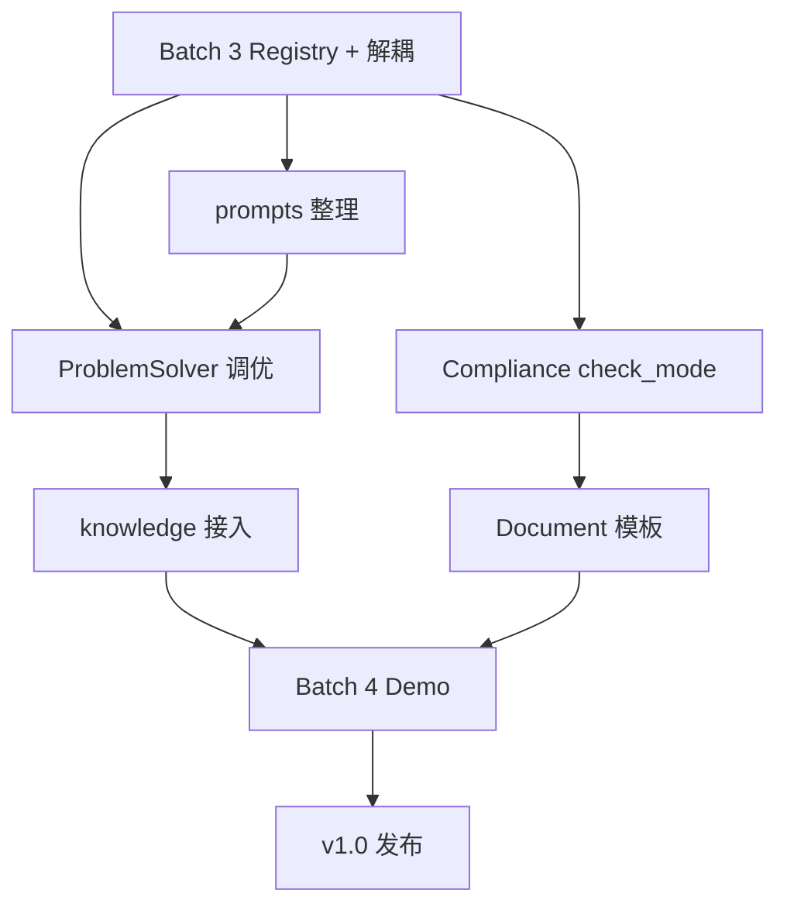
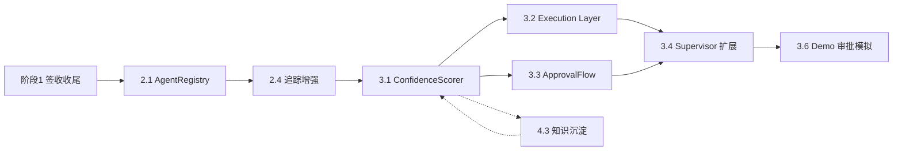

# Forge v1.0 实施计划

> 版本：3.0 | 2026-06-06 | 对齐文档：[`ARCHITECTURE.md`](ARCHITECTURE.md) rev4  
> 范围：**五阶段路线图（§22）核心项已签收** — Demo 专业化、v1.1 半自治、知识记忆、工程化  
> 原则：**先闭环质量，后优雅抽象**；168 offline tests；详见 §22 验收命令

---

## 1. 目标与完成定义

### 1.1 v1.0 交付物

| 交付物 | 说明 |
|--------|------|
| 稳定闭环 | 问题诊断 → 合规 → 资料 → PM 建议，离线/在线均可跑通 |
| 架构收口 | 6 Agent 全部经 ToolRegistry；agents/tools 解耦可审计 |
| 质量量化 | ProblemSolver 引用率 ≥70%；Compliance rule_id 映射 ≥80% |
| Demo | 等保 / ITIL / 混合 三场景一键演示 |
| 文档 | ARCHITECTURE + 本计划 + README 一致 |

### 1.2 不在本计划内

- AgentRegistry、SkillRegistry、`memory/` 独立包
- Web resume / SSE / 角色视图
- Docker、CI、多租户、外部系统集成
- `main.py` 全面重写（M3 仅瘦身，非阻塞项）

### 1.3 验证命令（每个 Batch 结束必跑）

```powershell
cd C:\Users\wangd\Desktop\forge
.\.venv\Scripts\python.exe -m pytest tests/ -q --ignore=tests/test_full_pipeline.py -k "not test_run_forge_cli_helper"
```

可选真实 LLM（需 `.env`）：

```powershell
.\run.bat --type security --no-feedback
.\run.bat --type itil --no-feedback
```

---

## 2. 里程碑总览

```
                    ┌─────────┐
                    │  起点   │  v0.1 基线（84 tests）
                    └────┬────┘
                         │
              ┌──────────▼──────────┐
              │  M1 架构收口         │  Batch 3
              │  ToolRegistry 6/6   │  约 1 周
              │  prompts 整理       │
              └──────────┬──────────┘
                         │
              ┌──────────▼──────────┐
              │  M2 闭环质量         │  Batch 3.5
              │  引用率/合规/文档    │  约 2 周
              │  knowledge_helpers  │
              └──────────┬──────────┘
                         │
              ┌──────────▼──────────┐
              │  M3 Demo 交付        │  Batch 4
              │  场景脚本/报告/文档  │  约 1 周
              └──────────┬──────────┘
                         │
                    ┌────▼────┐
                    │  v1.0   │
                    └─────────┘
```

| 里程碑 | Batch | 工期（建议） | 退出标准 |
|--------|-------|-------------|----------|
| **M1** 架构收口 | Batch 3 | 5–7 天 | 6 Agent Registry；pytest 全绿；无 Agent 内 `build_*_tools` |
| **M2** 闭环质量 | Batch 3.5 | 10–14 天 | M2 量化指标达标；三类 Document；knowledge 接入 |
| **M3** Demo 交付 | Batch 4 | 5–7 天 | 3 场景 demo；运行报告；README 更新 |

**总工期建议：4–5 周**（单人兼职按 50% 投入估算；含 LLM 调优缓冲）。

---

## 3. 当前基线快照（2026-06-06）

| 项 | 状态 |
|----|------|
| ToolRegistry 接入 | `problem_solver` ✅ `compliance` ✅ 其余 4 ❌ |
| Agent 直连 tools | `security.py` `operations.py` `pm_advisor.py` 仍 `build_*_tools` |
| Document | 直接 `generate_document_bundle`，未注册 Registry |
| Compliance check_mode | 未实现 |
| prompts | 13 文件，`*_prompt.py` 与 legacy 双份并存 |
| 测试 | 84 passed（离线） |
| main.py | ~856 行，待 M3 瘦身 |

---

## 4. Batch 3 — 架构收口（M1）

**目标**：ToolRegistry 6/6；消除 Agent–Tool 硬耦合；prompts 整理；Compliance check_mode 骨架。

### 4.1 任务清单

| ID | 任务 | 涉及文件 | 优先级 |
|----|------|----------|--------|
| B3-1 | Registry 注册 security / operations / pm_advisor | `core/tool_registry.py` | P0 |
| B3-2 | SecurityAgent 改用 `self.run_react()` | `agents/security.py` | P0 |
| B3-3 | OperationsAgent 改用 `self.run_react()` | `agents/operations.py` | P0 |
| B3-4 | PMAdvisorAgent 改用 `self.run_react()` | `agents/pm_advisor.py` | P0 |
| B3-5 | Document 工具注册（见 4.2） | `tools/document_tools.py`, `agents/document.py` | P0 |
| B3-6 | 扩展 `test_tool_registry.py` 覆盖 6 Agent | `tests/test_tool_registry.py` | P0 |
| B3-7 | Compliance `check_mode` 枚举 + state 字段 | `core/state.py`, `config.py` 或常量 | P1 |
| B3-8 | prompts legacy 合并（重导出兼容） | `prompts/*.py` → `prompts/{agent}/` | P1 |
| B3-9 | 耦合审计脚本或 grep 门禁（文档化） | `docs/` 或 `Makefile` target | P2 |

### 4.2 Document Registry 方案

Document 当前无 ReAct 工具链，两种可选实现（**推荐 A**）：

**方案 A（推荐）**：注册只读/生成类工具，Agent 仍主调 `generate_document_bundle`

```python
# tools/document_tools.py
def build_document_tools(state: ProjectState) -> list[BaseTool]:
  # list_templates, preview_section 等轻量工具
  ...

# agents/document.py — 可选 run_react 预览，主路径不变
```

**方案 B**：`build_document_tools` 返回空列表，仅满足 Registry 契约；`get_tools` 不用于 ReAct。

无论 A/B，Registry 键为 `document`，与 `DocumentAgent.name` 一致。

### 4.3 Security / Operations / PM 重构模式

对齐 `compliance.py` 已完成的模式：

```python
# 删除：create_react_agent, invoke_react_agent, get_llm, build_*_tools 直接调用
# 改为：
return self.run_react(
    state,
    system=SECURITY_SYSTEM,
    task=task,
    temperature=0.15,
    fallback=run_security_research(state, context),
)
```

保留 `run_*_research` 作为离线 fallback。

### 4.4 prompts 迁移步骤

1. 创建 `prompts/problem_solver/` 等 6 个子目录。
2. 将 `*_prompt.py` 内容迁入对应目录（如 `prompts.py` 单文件或 `system.py` + `react.py` + `structured.py`）。
3. 原 `prompts/problem_solver.py` 等 legacy 文件改为：

```python
"""Deprecated — use prompts.problem_solver.prompts."""
from forge.prompts.problem_solver.prompts import *  # noqa: F403
```

4. 全局搜索 import 路径，优先改 agents；legacy 重导出保证兼容。
5. 测试全绿后，在 README 注明新路径。

### 4.5 Compliance check_mode 骨架

| 模式 | 行为（M1 仅定义，M2 实现逻辑） |
|------|-------------------------------|
| `strict` | 任一缺口 → non_compliant |
| `advisory` | 缺口记为 partial，不阻断 Document |
| `lenient` | 仅高风险缺口阻断 |

```python
# core/state.py 或 config
check_mode: Literal["strict", "advisory", "lenient"]  # 默认 advisory
```

CLI：`--check-mode strict`（M2 接线）。

### 4.6 Batch 3 验收标准

- [ ] `get_tool_registry().list_agents()` 返回 6 个键
- [ ] `rg "build_(security|operations|pm_advisor)_tools" forge/agents/` 无匹配
- [ ] `pytest` 全绿，新增 registry 测试通过
- [ ] prompts 子目录存在，legacy import 不破坏现有测试
- [ ] `check_mode` 字段可写入 state（行为可仍为占位）

### 4.7 Batch 3 风险

| 风险 | 缓解 |
|------|------|
| Security/PM ReAct 重构引入回归 | 逐 Agent 提交；每步跑对应用例 `test_security.py` 等 |
| prompts 路径变更破坏 import | legacy 重导出保留 1 个里程碑 |
| Document 无 ReAct 却强行统一 | 采用方案 A 或 B，不虚构复杂工具 |

---

## 5. Batch 3.5 — 闭环打磨（M2）

**目标**：核心业务质量达标；M2 量化指标可测；knowledge 标签检索接入。

### 5.1 任务清单

| ID | 任务 | 涉及文件 | 优先级 |
|----|------|----------|--------|
| B35-1 | 标准场景测试集（3 类） | `tests/fixtures/scenarios/` 或 `tests/test_scenarios.py` | P0 |
| B35-2 | ProblemSolver Prompt 调优 | `prompts/problem_solver/` | P0 |
| B35-3 | 引用率统计与断言（≥70%，有 LLM 时） | `tests/test_problem_solver.py` | P0 |
| B35-4 | Compliance check_mode 完整逻辑 | `agents/compliance.py`, `tools/compliance_tools.py` | P0 |
| B35-5 | 检查项 rule_id 映射（≥80%） | `agents/compliance_output.py`, compliance_tools | P0 |
| B35-6 | Document 三类模板 | `tools/document_tools.py` | P1 |
| B35-7 | `utils/knowledge.py` | 新建 | P1 |
| B35-8 | ProblemSolver 接入 `search_knowledge` | `agents/problem_solver.py` | P1 |
| B35-9 | 运行报告 Markdown | `utils/run_report.py` 或 `cli/report.py` | P2 |
| B35-10 | main.py `--check-mode` | `main.py` | P2 |

### 5.2 标准场景测试集

| 场景 ID | 输入摘要 | 期望 problem_type | 期望 specialist |
|---------|----------|-------------------|-----------------|
| `sec-401` | 等保三级登录 401 认证失败 | security | security |
| `itil-outage` | ITIL 事件：核心交换机中断 SLA | service_management | operations |
| `mixed` | 等保测评缺口 + 变更未走 CAB | mixed | security + operations |

每个场景断言（离线）：

- 闭环跑完无异常
- `last_solution` 非空
- `last_compliance_result` 非空
- heuristic 路径下 `rule_pack_references` 尽力非空（为 LLM 路径留更高要求）

### 5.3 Document 三类交付物

| 模板 ID | 文件名建议 | 内容 |
|---------|-----------|------|
| `solution_summary` | 方案摘要 | 已有基础，强化结构 |
| `remediation_record` | 整改记录 | 缺口 + 措施 + 责任人占位 |
| `audit_or_change_record` | 测评/变更记录 | 等保或 ITIL 检查项对照 |

更新 `generate_document_bundle` 按合规状态决定生成哪些。

### 5.4 utils/knowledge.py API（草案）

```python
def append_knowledge(state, *, agent: str, summary: str, tags: list[str], detail: dict) -> dict: ...

def search_knowledge(state, *, tags: list[str] | None = None, agent: str | None = None, limit: int = 5) -> list[dict]: ...
```

ProblemSolver 在 `_run_react` 前：

```python
prior = search_knowledge(state, tags=[problem_type], limit=3)
# 注入 task 或 research_context
```

各 Agent 逐步改用 `append_knowledge` 替代手写 `knowledge_entry` dict（可分批）。

### 5.5 M2 量化验收

| 指标 | 测量方式 | 目标 |
|------|----------|------|
| rule_pack_references 覆盖率 | 标准场景集上，有 LLM 的方案中含 ≥1 引用的比例 | ≥ 70% |
| rule_id 映射率 | Compliance 检查项中带 `rule_id` 的比例 | ≥ 80% |
| 离线闭环 | 3 场景无 LLM pytest | 100% 通过 |

### 5.6 Batch 3.5 验收标准

- [ ] `check_mode` 三种模式行为可测且符合表 5.1
- [ ] 三类 Document 在合规通过/ partial 时可生成
- [ ] `utils/knowledge.py` 有单元测试
- [ ] ProblemSolver 使用 `search_knowledge`（至少测试验证注入）
- [x] 引用率 / 映射率测试存在（LLM 测试 `@pytest.mark.llm`，CI 默认排除）

---

## 6. Batch 4 — Demo 与交付（M3）

**目标**：对外可演示；文档齐全；v1.0 签收。

### 6.1 任务清单

| ID | 任务 | 涉及文件 | 优先级 |
|----|------|----------|--------|
| B4-1 | `cli/scenarios.py` 或 Makefile targets | `cli/scenarios.py`, `Makefile` | P0 |
| B4-2 | demo-security / demo-itil / demo-mixed | 同上 | P0 |
| B4-3 | `main.py` 瘦身：argparse → `cli/parser.py` | `main.py`, `cli/` | P1 |
| B4-4 | 运行报告 `--report` 输出 Markdown | `utils/run_report.py`, `main.py` | P1 |
| B4-5 | README 更新（功能表、架构链接、demo 命令） | `README.md` | P0 |
| B4-6 | ARCHITECTURE rev3 勾选 M1–M3 完成项 | `docs/ARCHITECTURE.md` | P0 |
| B4-7 | 集成测试 `test_full_pipeline.py` 纳入 CI 建议文档 | `tests/`, `docs/` | P2 |
| B4-8 | v1.0 签收清单走查 | 本文档 §7 | P0 |

### 6.2 Demo 命令目标

```powershell
make demo-security    # 或 .\run.bat --scenario security --save-result
make demo-itil
make demo-mixed
```

每次 demo 应输出：问题类型、合规状态、文档数量、耗时、报告路径。

### 6.3 main.py 瘦身范围（M3）

| 迁出模块 | 目标位置 |
|----------|----------|
| argparse 定义 | `cli/parser.py` |
| 场景预设常量 | `cli/scenarios.py` |
| 状态 inspect/list | `cli/state_commands.py` |
| 保留在 main | `main()` 入口、`run_forge` 调用 |

目标：`main.py` < 400 行（软目标，不阻塞 v1.0）。

### 6.4 Batch 4 验收标准

- [x] 3 个 demo 命令可重复执行且输出稳定（`make demo-*` 含 `--report`）
- [x] `--report` 生成可读 Markdown（含 pipeline_trace 摘要）
- [x] README 与 ARCHITECTURE、本计划一致
- [x] §7 签收清单全部勾选（含 LLM 引用率实测通过）

---

## 7. v1.0 签收清单

与 [`ARCHITECTURE.md` §A.1](ARCHITECTURE.md) 对齐，发布前逐项勾选：

### 功能

- [x] 离线启发式标准闭环 pytest 全绿（110+ 用例；含 `test_full_pipeline`）
- [x] ProblemSolver `rule_pack_references` 达标（≥70%）— 启发式已测；LLM 见 `test_llm_reference_coverage.py`
- [x] Compliance `check_mode` 三模式可用，rule_id 映射 ≥80%
- [x] Document ≥2 类实用 Markdown（7 份模板 bundle）
- [x] CLI：`--type`、save/load、思考链、`--check-mode`、`--report`、合规重试
- [x] 3 场景 demo 可一键运行（`make demo-*`）

### 架构

- [x] ToolRegistry 6/6
- [x] agents 互引限于 output 模型子包（无 Agent 类循环依赖）
- [x] tools 仅引用 agents 输出模型（非 Agent 类）
- [x] 未引入 AgentRegistry / Skill / memory 包

### 质量

- [x] pytest 全绿（`test_run_forge_cli_helper` 仍可选跳过）
- [x] 新增测试覆盖 registry、check_mode、knowledge、scenarios、metrics
- [x] 人机边界在文档中可读（ARCHITECTURE §A.2）

### 文档

- [x] README 更新
- [x] ARCHITECTURE rev3 M1–M3 标记完成
- [x] 本实施计划 Batch 状态更新

---

## 8. 依赖关系



**关键路径**：Batch 3 → Compliance/ProblemSolver 质量 → Demo → 签收。

---

## 9. 每周建议节奏（单人）

| 周 | 聚焦 | 产出 |
|----|------|------|
| W1 | Batch 3 | Registry 6/6；3 Agent 重构；pytest 绿 |
| W2 | Batch 3 收尾 + B35 启动 | prompts 子目录；check_mode 骨架；场景测试集 |
| W3 | Batch 3.5 | Prompt 调优；Compliance 完整；Document 模板 |
| W4 | Batch 3.5 收尾 | knowledge.py；量化测试；运行报告草案 |
| W5 | Batch 4 | demo 脚本；README；签收清单 |

可根据实际进度压缩 W4–W5 或延长 M2 调优。

---

## 10. 风险登记册

| ID | 风险 | 概率 | 影响 | 应对 |
|----|------|------|------|------|
| R1 | LLM 引用率达不到 70% | 中 | 高 | 强化 Prompt + json_prompt 模式；启发式路径也写入 refs |
| R2 | prompts 迁移破坏 import | 中 | 中 | legacy 重导出；小步提交 |
| R3 | scope creep（Web/Docker） | 中 | 高 | 严格对照 §1.2「不在计划内」 |
| R4 | main.py 瘦身拖慢 M2 | 低 | 低 | 明确为 M3 P1，可跳过 |
| R5 | Document 模板质量不足 | 中 | 中 | 用真实 Rule Pack 字段填充；PM 场景评审 |

---

## 11. 任务状态板（执行时更新）

| Batch | 状态 | 开始 | 完成 |
|-------|------|------|------|
| Batch 3 — M1 架构收口 | ✅ 完成 | 2026-06-06 | 2026-06-06 |
| Batch 3.5 — M2 闭环质量 | ✅ 完成 | 2026-06-06 | 2026-06-06 |
| Batch 4 — M3 Demo 交付 | ✅ 完成 | 2026-06-06 | 2026-06-06 |
| v1.0 签收 | ✅ 离线签收完成 | — | 2026-06-06 |

### Batch 3 已完成项

- ToolRegistry 6/6（problem_solver, compliance, security, operations, document, pm_advisor）
- security / operations / pm_advisor 改用 `self.run_react()` + Registry
- `check_mode` 骨架（state + config + `utils/check_mode.py`）
- `agents/__init__.py` 瘦身，消除循环导入
- `prompts/problem_solver/` 包结构 + 删除 legacy `problem_solver.py`
- 93+ pytest 通过

### Batch 3.5 已完成项

- `utils/knowledge.py` + ProblemSolver `prior_cases` 注入
- Document 新增 `solution_summary`、`remediation_record` 模板（共 7 份）
- `test_knowledge.py`、`test_check_mode.py`

### Batch 3.5 补充（已完成）

- `utils/metrics.py` — 引用率 / rule_id 映射率
- Compliance `CheckItem.rule_id` + tools 全面填充
- `tests/test_metrics.py`、`tests/test_scenarios_integration.py`
- 6 Agent `prompts/<agent>/` 包结构

### Batch 4 已完成 / 待办

- [x] `cli/scenarios.py` + `cli/parser.py` + `make demo-mixed`
- [x] `--check-mode` / `--report`
- [x] 场景问题文案修正（触发 ProblemSolver 闭环）
- [x] `main.py` 瘦身至 ~255 行（`cli/runner`、`resolvers`、`result_print`、`ansi`）
- [x] v1.0 签收清单 §7 离线项走查
- [x] 真实 LLM 下引用率 ≥70% 验证（`tests/test_llm_reference_coverage.py` + `make test-llm` + CI `workflow_dispatch`）

---

## 12. 相关文档

| 文档 | 用途 |
|------|------|
| [`ARCHITECTURE.md`](ARCHITECTURE.md) | 架构边界、模块契约、North Star |
| [`README.md`](../README.md) | 用户入门与功能说明 |
| `.env.example` | LLM 与配置项 |

---

## 修订记录

| 版本 | 日期 | 变更 |
|------|------|------|
| 1.0 | 2026-06-06 | 初版：对齐 ARCHITECTURE rev3；Batch 3/3.5/4 任务分解与签收清单 |
| 1.1 | 2026-06-06 | v1.0 交付后：demo_seed、prompts 迁入子目录、Web 参数扩展 |

---

## 13. v1.1 打磨（v1.0 交付后）

| 项 | 状态 |
|----|------|
| `--demo-seed` 演示证据预置（`cli/demo_seed.py`） | ✅ |
| Prompt 正文迁入 `prompts/<agent>/prompts.py` | ✅ |
| Web `check_mode` / `problem_type_hint` / `demo_seed` | ✅ |
| ARCHITECTURE rev4 进度同步 | ✅ |
| Rich CLI Demo（`cli/demo_display.py`）+ `--plain` | ✅ |
| `confidence_score` / `risk_level` 字段 + finalize 写入 | ✅ |
| `knowledge_helpers` + handoff 记录 | ✅ |
| AgentRegistry / Docker / 五阶段 §22 | ✅ 见 §22 |

---

## 14. 四阶段路线图总览（2026-06 起）

> 在 v1.0（Batch 3/3.5/4）签收基础上，按 **闭环稳定 → 架构收口 → 半自治 → 知识记忆** 推进。  
> **当前焦点**：阶段 1 签收收尾 → 阶段 2 启动 → **阶段 3.1 ConfidenceScorer**（v1.1 入口）。

```
阶段 1 核心闭环稳定 + Demo     ███████████  100%  已签收
阶段 2 架构收口与一致性         ███████████  100%  AgentRegistry + 追踪
阶段 3 半自治执行（v1.1）       ███████████  100%  Confidence + Execution + Approval
阶段 4 知识与记忆（长期）       ██████████░  ~90%  图谱 stub；语义检索留 §B
```

| 阶段 | 建议工期 | 建议启动 | 完成标志 |
|------|----------|----------|----------|
| **阶段 1** | 2–3 周 | ✅ 已基本完成 | Demo 三场景可演示；三种 check_mode；Registry 6/6 |
| **阶段 2** | 1–2 周 | 阶段 1 签收后立刻 | 新 Agent 有固定 checklist；Supervisor 少硬编码 |
| **阶段 3** | 2–3 周 | 阶段 2 核心完成后 | Demo 模拟「生成任务 → 置信度 → 审批 → 执行」 |
| **阶段 4** | 持续 | 可与阶段 3 并行 | 项目级记忆可检索、可沉淀、可演进 |

**验证命令（每阶段结束）**：

```powershell
.\.venv\Scripts\python.exe -m pytest tests/ -q -k "not test_run_forge_cli_helper" -m "not llm"
.\run.bat --type security --no-feedback
.\run.bat --type operations --no-feedback
.\run.bat --type mixed --no-feedback
```

---

## 15. 阶段 1 — 核心闭环稳定 + Demo 可演示

**目标**：系统集成场景下核心流程跑得稳、看得清、能演示。

### 15.1 任务状态板

| 编号 | 任务 | 状态 | 代码锚点 | 剩余工作 |
|------|------|------|----------|----------|
| **1.1** | ProblemSolver 能力提升 | ✅ | `agents/problem_solver.py`、`rule_pack_refs.py`、`prompts/problem_solver/` | 可选：LLM 场景回归；混合场景 prompt 微调 |
| **1.2** | Compliance 能力提升 | ✅ | `utils/check_mode.py`、`agents/compliance.py`、`tools/compliance_tools.py` | 可选：strict 下重试策略文档化 |
| **1.3** | 耦合清理（ToolRegistry） | ✅ | `core/tool_registry.py`、`tests/test_agent_decoupling.py` | 无；保持 AST 门禁 |
| **1.4** | CLI Demo 体验提升 | ✅ | `cli/demo_display.py`、`cli/stats.py`、`main.py --plain` | 可选：Web 复用 Rich 片段 |
| **1.5** | knowledge_helpers | ✅ | `utils/knowledge.py`；ProblemSolver ReAct 前 `search_knowledge` | 见阶段 4 深化 |
| **1.6** | ProjectState 增强 | ✅ | `core/state.py`：`confidence_score`、`risk_level`；`conversation_history` handoff | 持久化 `_RUN_RESET_FIELDS` 已兼容 |
| **1.7** | 核心测试补充 | ✅ | `test_problem_solver.py`、`test_compliance.py`、`test_knowledge.py`、`test_cli_stats.py` | 146 offline passed |

### 15.2 阶段 1 签收清单（DoD）

- [x] `make demo-security` / `demo-itil` / `demo-mixed` 一键可跑
- [x] Rich 故事板：问题 → 方案 → 合规（含重试时间线）→ 资料 → PM → 统计
- [x] `--check-mode strict|advisory|lenient` 行为可测（`test_check_mode.py`）
- [x] 6 Agent 经 `BaseAgent.get_tools()`，无 `build_*_tools` 直连
- [x] 启发式引用率 / rule_id 映射率门禁（`test_metrics.py`）
- [x] CI `workflow_dispatch` 已配置（`make test-llm` 需 API Key 手动触发）

### 15.3 阶段 1 收尾（≤2 天）

| 顺序 | 动作 | 产出 |
|------|------|------|
| 1 | 三场景 smoke + `--report` 归档样例 | `reports/demo-*.md` 样例 |
| 2 | README「Demo 故事板」一节 | 用户可见 `--plain` / 场景说明 |
| 3 | 更新 ARCHITECTURE §A.9 勾选 Rich Demo | 文档一致 |

---

## 16. 阶段 2 — 架构收口与一致性提升

**目标**：结构清晰、解耦彻底，新增 Agent 可按 checklist 接入。

### 16.1 任务分解

| 编号 | 任务 | 状态 | 优先级 | 建议顺序 | 涉及文件 |
|------|------|------|--------|----------|----------|
| **2.1** | 轻量 AgentRegistry | ✅ | P0 | 1 | `core/agent_registry.py`；`workflow.py` 经 Registry |
| **2.2** | 统一 Agent 输出结构 | ✅ | — | — | `agents/output_base.py`；各 `*_output.py` |
| **2.3** | prompts 目录整理 | ✅ | — | — | `prompts/<agent>/prompts.py`；legacy 重导出 |
| **2.4** | 运行时日志与追踪增强 | ✅ | P1 | 2 | `agent_runner.py` `duration_ms`；`run_report.py` handoff |
| **2.5** | 代码风格与注释统一 | ✅ | P2 | 3 | 新模块 docstring + 契约注释 |

### 16.2 任务 2.1 — AgentRegistry 设计要点

**不做**：YAML 外置 workflow、动态热加载（留 §B）。

**最小 API**：

```python
# core/agent_registry.py（拟议）
register_agent(name: str, agent_cls: type[BaseAgent], *, node_fn: Callable | None = None)
get_agent(name: str) -> BaseAgent
list_agents() -> list[str]
```

**迁移步骤**：

1. 将 `workflow.py` 中 Agent 实例化改为 Registry `get_agent`
2. Supervisor 路由表从 `AgentName` 枚举 + Registry 查表，删除重复 `if agent == ...` 分支（保留合规重试等特殊边）
3. 新增 `tests/test_agent_registry.py`：注册、获取、未注册抛错
4. 更新 ARCHITECTURE §A.10「新增 Agent 检查清单」第 3 步为 Registry

**退出标准**：新增 mock Agent 仅需 4 文件（agent、tools、registry 一行、test），不改 Supervisor 主体。

### 16.3 任务 2.4 — 追踪增强（在现有 `pipeline_trace` 上扩展）

| 子项 | 说明 |
|------|------|
| 统一 trace 事件 schema | `agent`、`status`、`duration_ms`、`check_mode`、`retry_generation` |
| `--report` 增加 Handoff 表 | 读 `conversation_history` event=handoff |
| Supervisor 每节点计时 | `time.perf_counter()` 写入 trace |

---

## 17. 阶段 3 — 半自治执行能力（v1.1）

**目标**：AI 生成可执行内容 + 受控审批，Demo 可模拟全流程。

### 17.1 任务总览

| 编号 | 任务 | 状态 | 依赖 | 建议顺序 |
|------|------|------|------|----------|
| **3.1** | ConfidenceScorer | ✅ | 阶段 1 `confidence_score` 字段 | 完成 |
| **3.2** | Execution Layer（基础） | ✅ | 3.1 | `core/execution/` |
| **3.3** | ApprovalFlow（基础） | ✅ | 3.1 | `core/approval/` |
| **3.4** | Supervisor 流程扩展 | ✅ | 3.2、3.3 | PM → Execution → Approval → Finalize |
| **3.5** | ProjectState 执行字段 | ✅ | 3.2 | `execution_tasks` 等 |
| **3.6** | CLI Demo 审批模拟 | ✅ | 3.3、3.4 | `--auto-approve` / `--approve` |

### 17.2 任务 3.1 — ConfidenceScorer（详细设计）

#### 现状

- `forge/cli/stats.py` 中 `compute_confidence_score()` 为**启发式占位**（合规状态 + 重试 + 引用数 + agent_errors）
- `finalize_node` 写入 `ProjectState.confidence_score`；Demo 统计面板展示
- **缺口**：无独立模块、无历史成功率、无可配置权重、CLI 与 core 耦合

#### 目标

将置信度计算提升为 **可测试、可配置、可扩展** 的 v1.1 核心模块，为 ApprovalFlow（3.3）提供唯一决策输入。

#### 模块布局

```
forge/core/confidence/
├── __init__.py          # export ConfidenceScorer, ConfidenceResult
├── scorer.py            # ConfidenceScorer 主类
├── factors.py           # 各因子计算器（纯函数）
└── config.py            # 默认权重与阈值（可从 settings 覆盖）
```

#### 数据模型

```python
@dataclass
class ConfidenceFactors:
    compliance_factor: float      # 0–1，来自 compliance_status + check_mode
    evidence_factor: float        # Rule Pack 引用数、检查项覆盖
    retry_penalty: float          # compliance_retry_count 衰减
    error_penalty: float          # agent_errors / degraded_agents
    history_factor: float         # v1.1 先 stub=0.5；后续接 knowledge 成功率

@dataclass
class ConfidenceResult:
    score: float                  # 0.0–1.0
    level: str                    # high | medium | low
    factors: ConfidenceFactors
    recommendation: str           # auto_execute | needs_review | block
    explanation: list[str]        # 供 Demo / 报告展示
```

#### 评分公式（v1.1 初版）

```
raw = w_c * compliance_factor
    + w_e * evidence_factor
    + w_h * history_factor
    - w_r * retry_penalty
    - w_err * error_penalty

score = clamp(raw, 0.0, 1.0)
```

**默认权重**（`config.py`，总和不必为 1，按因子尺度归一）：

| 因子 | 默认 w | 说明 |
|------|--------|------|
| compliance | 0.40 | compliant=1.0, partial=0.6, non_compliant=0.2；strict 模式 ×0.9 |
| evidence | 0.25 | `min(1.0, refs/5)` + 合规项 rule_id 映射率 |
| history | 0.15 | 初版固定 0.5；4.3 后接 `knowledge_base` 同类案例成功率 |
| retry_penalty | 0.12/次 | 上限 0.36 |
| error_penalty | 0.08/个 | 上限 0.24 |

**阈值 → recommendation**：

| score | level | recommendation |
|-------|-------|----------------|
| ≥ 0.75 | high | `auto_execute`（仍受 Compliance 红线约束） |
| 0.45–0.74 | medium | `needs_review` |
| < 0.45 | low | `block` |

#### 集成点

| 位置 | 变更 |
|------|------|
| `supervisor.finalize_node` | `from forge.core.confidence import ConfidenceScorer`；替换 `cli.stats` import |
| `cli/stats.py` | `compute_confidence_score` 委托给 `ConfidenceScorer.score_from_state()` |
| `core/state.py` | 可选：`confidence_level`、`confidence_recommendation` 字段 |
| `agents/compliance.py` | 输出中附带 `evidence_coverage` 供 evidence_factor |
| Demo | `demo_display` 展示 factors 分解树（Rich Tree） |

#### 实施步骤（建议 3–4 天）

| 天 | 步骤 | 测试 |
|----|------|------|
| D1 | 创建 `factors.py` 纯函数 + `ConfidenceResult` | `test_confidence_factors.py` |
| D2 | `ConfidenceScorer.score(state)` + 配置 | `test_confidence_scorer.py` 矩阵用例 |
| D3 | 迁移 finalize / cli.stats；保持旧分数近似 | 回归 `test_cli_stats.py` |
| D4 | Demo factors 树 + `--report` 一节 | 手动 smoke |

#### 测试矩阵（离线必覆盖）

- compliant + 0 retry + ≥3 refs → score ≥ 0.75
- partial + 1 retry → medium
- non_compliant + strict → low / block
- agent_errors ≥ 2 → 显著降分
- 与旧 `compute_confidence_score` 偏差 ≤ 0.15（迁移兼容）

#### 与 3.3 ApprovalFlow 的契约

```python
# approval_flow.py（3.3 消费）
if result.recommendation == "needs_review":
    create_approval_request(state, reason=result.explanation)
elif result.recommendation == "block":
    skip_execution_layer(state)
```

### 17.3 任务 3.2–3.6 概要（3.1 完成后）

| 编号 | 核心交付 | 关键文件 |
|------|----------|----------|
| 3.2 | `ExecutionTask` 模型 + 生成 remediation WBS / 变更申请草稿 | `core/execution/`、`agents/execution.py` |
| 3.3 | `ApprovalRequest` 状态机：pending → approved/rejected | `core/approval/flow.py` |
| 3.4 | Supervisor 在 finalize 前插入 `execution_node` → `approval_gate_node` | `core/supervisor.py`、`core/workflow.py` |
| 3.5 | state：`execution_tasks[]`、`approval_requests[]`、`pending_approvals` | `core/state.py` |
| 3.6 | Demo 面板「⑥ 待审批任务」+ `--approve` / `--reject` 模拟 | `cli/demo_display.py`、`main.py` |

---

## 18. 阶段 4 — 知识与记忆能力增强

**目标**：项目级记忆与知识复用（长期差异化）。

| 编号 | 任务 | 状态 | 说明 |
|------|------|------|------|
| **4.1** | knowledge_base 结构化 | ✅ | `type`、`related_rules`、`outcome` |
| **4.2** | 知识检索增强 | ✅ | 多 tag 重叠评分排序 |
| **4.3** | 知识自动沉淀 | ✅ | `utils/knowledge_extract.py` + finalize |
| **4.4** | Memory Graph 数据模型 | ✅ | `core/memory/graph.py` stub |
| **4.5** | 知识库 CLI 可视化 | ✅ | `py main.py kb search --tag security` |

**与 3.1 衔接**：`history_factor` 在 4.3 完成后读取 `knowledge_base` 中同 `problem_type` 案例的 `outcome` 字段计算成功率。

---

## 19. 推荐执行顺序（接下来 4–6 周）



| 周 | 聚焦 | 交付物 |
|----|------|--------|
| **W1** | 阶段 1 签收 + 2.1 | AgentRegistry MVP；README Demo 节 |
| **W2** | 2.4 + 3.1 D1–D4 | ConfidenceScorer 模块 + 测试 + Demo factors |
| **W3** | 3.2 + 3.3 | ExecutionTask / ApprovalRequest 模型与状态机 |
| **W4** | 3.4 + 3.5 + 3.6 | Supervisor 半自治分支；CLI 审批模拟 |
| **W5+** | 4.1–4.3 与 3.1 history_factor 闭环 | 知识沉淀 + 置信度历史因子 |

**并行策略**：阶段 4 的 4.1 字段扩展可与 3.2 并行；4.4 Memory Graph 仅设计不写实现。

---

## 20. 任务状态板（四阶段，执行时更新）

| 阶段 | 任务 | 状态 | 负责人 | 目标完成 |
|------|------|------|--------|----------|
| 1 | 1.1–1.7 | ✅ | — | 2026-06 |
| 1 | 签收收尾（§15.3） | ✅ | — | 2026-06-06 |
| 2 | 2.1 AgentRegistry | ✅ | `core/agent_registry.py` | 2026-06-06 |
| 2 | 2.4 追踪增强 | ✅ | `duration_ms` + report handoff | 2026-06-06 |
| 2 | 2.5 注释统一 | ✅ | 核心模块 docstring | 2026-06-06 |
| 3 | **3.1 ConfidenceScorer** | ✅ | `core/confidence/` | 2026-06-06 |
| 3 | 3.2–3.6 | ✅ | execution/approval + CLI | 2026-06-06 |
| 4 | 4.1–4.2 | ✅ | 结构化 KB + 排序检索 | 2026-06-06 |
| 4 | 4.3–4.5 | ✅ | 沉淀 + graph stub + `kb` CLI | 2026-06-06 |

---

## 21. 修订记录（续）

| 版本 | 日期 | 变更 |
|------|------|------|
| 2.0 | 2026-06-06 | 四阶段路线图 §14–§20；ConfidenceScorer 详细设计 §17.2；阶段 1 签收状态 |
| 3.0 | 2026-06-06 | **五阶段路线图 §22**；Feedback Loop；Execution/Approval 模型；Docker；168 tests |

---

## 22. 五阶段详细路线图（2026-06 版）

> 可执行分阶段计划。每阶段完成标志 + 验证命令 + 代码锚点。  
> **当前状态：阶段 1–5 核心项已签收**（168 offline tests passed）。

```
阶段 1 核心闭环 + Demo 专业化   ███████████  100%
阶段 2 架构收口与一致性         ███████████  100%
阶段 3 半自治执行 v1.1          ███████████  100%
阶段 4 知识与记忆增强           ███████████  100%
阶段 5 工程化测试与文档         ███████████  100%
```

### 22.1 阶段 1 — 核心闭环稳定 + Demo 专业化

| 步骤 | 任务 | 状态 | 代码锚点 |
|------|------|------|----------|
| 1.1 | ProblemSolver 能力强化 | ✅ | `agents/problem_solver.py`、`rule_pack_refs.py` |
| 1.2 | Compliance + check_mode | ✅ | `utils/check_mode.py`、`agents/compliance.py` |
| 1.3 | ToolRegistry 6/6 解耦 | ✅ | `test_agent_decoupling.py` |
| 1.4 | CLI Demo Rich 故事板 | ✅ | `cli/demo_display.py` — Agent 追踪表 + 运行摘要 |
| 1.5 | 单次运行报告 | ✅ | `utils/report.py` → `generate_run_report()` |
| 1.6 | knowledge_helpers | ✅ | `utils/knowledge.py`；ProblemSolver 案例检索 |
| 1.7 | ProjectState 字段 | ✅ | `confidence_score`、`risk_level`、`execution_tasks`… |
| 1.8 | 核心单元测试 | ✅ | `test_problem_solver`、`test_compliance`、`test_knowledge` |

**DoD**：三场景 Demo；三种 check_mode；引用率门禁 `test_metrics.py`。

### 22.2 阶段 2 — 架构收口与一致性

| 步骤 | 任务 | 状态 | 代码锚点 |
|------|------|------|----------|
| 2.1 | AgentRegistry | ✅ | `core/agent_registry.py` |
| 2.2 | AgentOutputBase | ✅ | `agents/output_base.py` |
| 2.3 | prompts 分目录 | ✅ | `prompts/<agent>/prompts.py` |
| 2.4 | Supervisor 清晰化 | ✅ | `core/supervisor_routing.py`；`docs/AGENT_CHECKLIST.md` |
| 2.5 | pipeline_trace 结构化 | ✅ | `utils/trace.py` — input/output_summary |
| 2.6 | 代码规范 | ✅ | 核心模块 docstring + checklist |

### 22.3 阶段 3 — 半自治执行 v1.1

| 步骤 | 任务 | 状态 | 代码锚点 |
|------|------|------|----------|
| 3.1 | ConfidenceScorer | ✅ | `core/confidence/` |
| 3.2 | Execution Layer | ✅ | `core/execution/` |
| 3.3 | ApprovalFlow | ✅ | `core/approval/flow.py` |
| 3.4 | Supervisor 流程扩展 | ✅ | PM → Execution → Approval → Finalize |
| 3.5 | 数据模型 | ✅ | `ExecutionTask`、`ExecutionResult`、`ApprovalRequest`；`execution_results` state |
| 3.6 | CLI 审批模拟 | ✅ | `--auto-approve` / `--approve` / `--reject` |
| 3.7 | Feedback Loop | ✅ | `utils/feedback_loop.py` + `simulate_execution` |

**DoD**：`make demo-security --auto-approve` 可见执行任务 + 审批状态。

### 22.4 阶段 4 — 知识与记忆

| 步骤 | 任务 | 状态 | 代码锚点 |
|------|------|------|----------|
| 4.1 | KB 结构化 | ✅ | `type`、`related_rules`、`outcome`、`source` |
| 4.2 | 检索增强 | ✅ | 多 tag + keywords 排序 |
| 4.3 | 自动沉淀 | ✅ | `utils/knowledge_extract.py` |
| 4.4 | KB CLI | ✅ | `main.py kb search` |
| 4.5 | Memory Graph stub | ✅ | `core/memory/graph.py` |

### 22.5 阶段 5 — 工程化、测试与文档

| 步骤 | 任务 | 状态 | 代码锚点 |
|------|------|------|----------|
| 5.1 | 集成测试 | ✅ | `test_full_pipeline`、`test_v11_pipeline_integration` |
| 5.2 | Makefile / 脚本 | ✅ | `make test-integration`、`make report`、`make docker` |
| 5.3 | README | ✅ | Demo 故事板、架构、路线图引用 |
| 5.4 | Docker（可选） | ✅ | `Dockerfile`、`docker-compose.yml` |
| 5.5 | 代码审查 | ✅ | `docs/CODE_REVIEW.md`、`docs/COMPLIANCE_CHECK_MODE.md` |

### 22.6 阶段验收命令

```powershell
# 离线全量
.\.venv\Scripts\python.exe -m pytest tests/ -q -k "not test_run_forge_cli_helper" -m "not llm"

# 集成子集
make test-integration

# Demo + 报告
.\run.bat --type security --auto-approve --no-feedback --no-report-prompt
make report

# 知识库
.\run.bat kb search --tag security

# Docker Web（需 .env）
docker compose up --build
```

### 22.8 Grok 精细版对照

完整逐项评估见 [`ROADMAP_EVALUATION.md`](ROADMAP_EVALUATION.md)。结论：**阶段 1–5 核心步骤均已签收**，无需重复实施。

### 22.7 后续可选（§B North Star）

- 向量语义检索 / `memory/` 独立包
- Web SSE、审批 UI 产品化
- 真实 CMDB / 工单系统 Execution 对接
- CI `workflow_dispatch` LLM 引用率 job（需 API Key）
