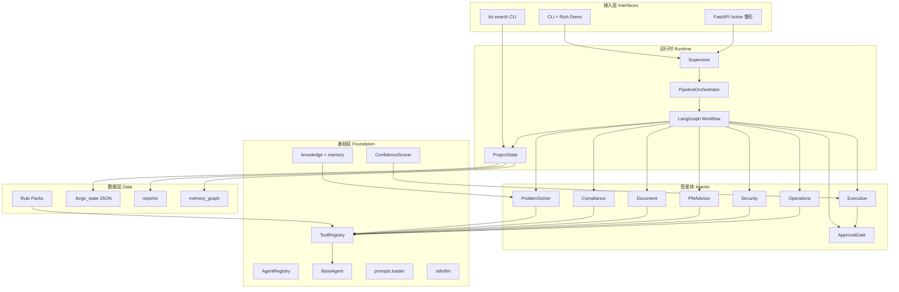

# Forge 分阶段实施计划（v1.0 → v2.0）

> 与整体架构愿景对齐的可执行路线图 | 更新：2026-06-07  
> **验收刻度（路径 A）**：[`PATH_A_QUALITY.md`](PATH_A_QUALITY.md) — W1 已签收  
> **核心能力 Scorecard**：[`CORE_CAPABILITY_SCORECARD.md`](CORE_CAPABILITY_SCORECARD.md) — `eval_core_capability.py`  
> **当前版本规划**：[`V1.2_ROADMAP.md`](V1.2_ROADMAP.md)  
> 交付签收：`STAGE1_SIGNOFF.md` · 质量收口：`QUALITY_POLISH.md` · 全量任务表：`IMPLEMENTATION_PLAN.md` §22

---

## 一、整体架构（当前实现）



**设计原则（已落地）**

| 原则 | 实现 |
|------|------|
| 解耦 | Agent 不经 ToolRegistry 外直引 `build_*_tools`；Prompt 经 `loader.get_prompt` |
| 可扩展 | `AgentRegistry` + `ToolRegistry`；SkillRegistry 留 v2.0 |
| 可观测 | `pipeline_trace`、`conversation_history`、Run Report |
| 人机协作 | v1.1：置信度 → 审批门控 → 执行后端（simulate / manifest / webhook） |

---

## 二、五阶段总览

| 阶段 | 目标 | 建议工期 | **当前进度** | 下一步 |
|------|------|----------|--------------|--------|
| **1** 核心闭环 + Demo | 可演示、可理解、Rule Pack 稳定 | 2–3 周 | **100% 签收** | 维护 + LLM 回归 |
| **2** 架构收口 | 解耦一致、易扩展 | 1–2 周 | **100%** | SkillRegistry 设计 |
| **3** 半自治 v1.1 | 任务生成 → 审批 → 执行 | 2–3 周 | **100%** | 真实工单/CMDB 对接 |
| **4** 知识记忆 | 检索 + 沉淀 + 图谱 | 持续 | **~95%** | 向量语义检索 |
| **5** 工程化 | 测试、脚本、文档 | 1 周穿插 | **100%** | CI LLM job |

**离线测试基线**：218 passed（`-m "not llm"`）  
**验收刻度**：阶段 1 交付 100% / 路径 A 验收 ~90%+（见 `reports/llm_baseline/w1_signoff.json`）

---

## 三、阶段 1 — 核心闭环稳定 + Demo 专业化

**目标**：系统集成场景下 ProblemSolver → Compliance 闭环稳定，Demo 能讲清决策过程。

| 步骤 | 任务 | 关键路径 | 完成标准 | 状态 |
|------|------|----------|----------|------|
| 1.1 | ProblemSolver 深度优化 | `agents/problem_solver.py`、`prompts/problem_solver/prompts.py`、`rule_pack_refs.py` | ≥3 条 Rule Pack；`reasoning`/`confidence`；引用率测试 | ✅ |
| 1.2 | Compliance + check_mode | `agents/compliance.py`、`utils/check_mode.py`、`compliance_explain.py` | strict/advisory/lenient；`matched_rules`/`failed_items`/`suggestions` | ✅ |
| 1.3 | ToolRegistry 落地 | `core/tool_registry.py`、`test_agent_decoupling.py` | 6 Agent 无直引 build_tools | ✅ |
| 1.4 | CLI Demo 结构化 | `cli/demo_display.py`、`cli/scenarios.py` | Rich 故事板 + 合规重试时间线 | ✅ |
| 1.5 | 运行报告 | `utils/report.py` | 决策链路 + 合规追溯 + 可保存 `reports/` | ✅ |
| 1.6 | knowledge_helpers | `utils/knowledge.py`、`knowledge_memory.py` | ProblemSolver ReAct 注入历史案例 | ✅ |
| 1.7 | ProjectState 字段 | `core/state.py` | `confidence_score`、`risk_level`、`execution_tasks`… | ✅ |
| 1.8 | 核心测试 | `tests/test_*` | ProblemSolver / Compliance / knowledge 有覆盖 | ✅ |

**阶段 1 DoD（已满足）**

- [x] 三场景（security / itil / mixed）离线闭环
- [x] Demo 可展示方案、合规、重试、Handoff
- [x] `test_llm_reference_coverage.py` 引用率 ≥70%（需 API Key）

**验证**

```powershell
.\.venv\Scripts\python.exe -m pytest tests/test_scenarios_integration.py tests/test_prompts_abcd.py -q
.\run.bat --type security --auto-approve --no-feedback
```

---

## 四、阶段 2 — 架构收口与一致性

**目标**：新增 Agent 有固定路径，Supervisor 少硬编码。

| 步骤 | 任务 | 关键路径 | 完成标准 | 状态 |
|------|------|----------|----------|------|
| 2.1 | AgentRegistry | `core/agent_registry.py`、`workflow.py` | 节点注册集中化 | ✅ |
| 2.2 | AgentOutputBase | `agents/output_base.py`、`*_output.py` | `to_state_dict()` / `to_display_json()` | ✅ |
| 2.3 | Prompts 解耦 | `prompts/loader.py`、`get_prompt()` | `test_prompts_loader.py` 门禁 | ✅ |
| 2.4 | Supervisor 文档化 | `core/supervisor_routing.py`、`docs/AGENT_CHECKLIST.md` | 路由边可追踪 | ✅ |
| 2.5 | pipeline_trace | `utils/trace.py`、`agent_runner.py` | input/output_summary + duration | ✅ |

**阶段 2 DoD（已满足）**

- [x] 按 `AGENT_CHECKLIST.md` 可接入新 Agent
- [x] agents 不互引实现类；tools 不引 agents

---

## 五、阶段 3 — 半自治执行（v1.1）

**目标**：AI 生成可执行任务，经置信度与审批门控后受控执行。

| 步骤 | 任务 | 关键路径 | 完成标准 | 状态 |
|------|------|----------|----------|------|
| 3.1 | ConfidenceScorer | `core/confidence/` | 合规/证据/历史因子 → auto_execute / needs_review / block | ✅ |
| 3.2 | Execution Layer | `core/execution/generator.py`、`node.py` | 从合规缺口 + PM 行动项生成任务 | ✅ |
| 3.3 | ApprovalFlow | `core/approval/flow.py`、`node.py` | pending / auto_approved / blocked | ✅ |
| 3.4 | Workflow 扩展 | `workflow.py` | PM → Execution → Approval → Finalize | ✅ |
| 3.5 | 数据模型 | `ExecutionTask`、`ExecutionResult`、`ApprovalRequest` | 写入 ProjectState | ✅ |
| 3.6 | CLI 审批 Demo | `--auto-approve` / `--approve` / `--reject` | Demo 可见执行任务与审批 | ✅ |
| 3.7 | 执行后端 | `core/execution/backend.py` | simulate / local_manifest / webhook | ✅ |
| 3.8 | Feedback Loop | `utils/feedback_loop.py` | 审批/执行结果写入 knowledge | ✅ |

**阶段 3 DoD（已满足）**

- [x] `test_v11_pipeline_integration.py` 通过
- [x] `--execution-mode local_manifest` 写 `reports/execution/*.json`

**v1.2 深化（见 [`V1.2_ROADMAP.md`](V1.2_ROADMAP.md)）**

- [ ] Webhook 契约 + ITSM/generic 适配器 POC
- [ ] Embedding 混合检索（ProblemSolver）
- [ ] Web Run Report 只读查看器
- [ ] （v1.3）审批 UI + SSE

---

## 六、阶段 4 — 知识与记忆

**目标**：项目级记忆可检索、可沉淀、可演进。

| 步骤 | 任务 | 关键路径 | 完成标准 | 状态 |
|------|------|----------|----------|------|
| 4.1 | KB 结构化 | `utils/knowledge.py` | type、tags、outcome、related_rules | ✅ |
| 4.2 | 检索增强 | `knowledge_memory.search_similar_cases` | 多 tag + 关键词 + graph 加权 | ✅ |
| 4.3 | 自动沉淀 | `knowledge_extract.py`、finalize | 会话摘要 + memory_graph 重建 | ✅ |
| 4.4 | Memory Graph | `core/memory/graph.py` | case ↔ rule 边 | ✅ stub |
| 4.5 | KB CLI | `cli/kb.py` | `run.bat kb search --tag` | ✅ |

**阶段 4 DoD（基本满足）**

- [x] ProblemSolver 利用历史案例
- [x] finalize 写入 knowledge_base
- [x] `history_factor` 读取同类 outcome

**待深化（v2.0）**

- [ ] 向量语义检索（embedding）
- [ ] `memory/` 独立包 + 跨会话持久图谱

---

## 七、阶段 5 — 工程化、测试与文档

| 步骤 | 任务 | 关键路径 | 完成标准 | 状态 |
|------|------|----------|----------|------|
| 5.1 | 集成测试 | `test_full_pipeline`、`test_v11_*`、`test_scenarios_integration` | 含无 LLM 全闭环 | ✅ |
| 5.2 | 脚本 / Makefile | `Makefile`、`scripts/demo.ps1` | test / demo / report / docker | ✅ |
| 5.3 | 文档 | `README.md`、`ARCHITECTURE.md`、本文件 | 与代码一致 | ✅ |
| 5.4 | 代码审查 | `CODE_REVIEW.md`、`QUALITY_POLISH.md` | 212 tests 基线 | ✅ |
| 5.5 | Docker（可选） | `Dockerfile`、`docker-compose.yml` | Web 雏形可起 | ✅ |

---

## 八、推荐执行节奏（从现在起）

```text
[已完成] 阶段 1 签收 ──► 阶段 2–5 核心
                │
                ▼
[已完成] 路径 A 质量收口（W1 签收）
                │
                ▼
[当前焦点] v1.2 — 见 V1.2_ROADMAP.md
    Sprint 1: Webhook 契约 + mock server
    Sprint 2: ITSM/generic 适配器 POC
    Sprint 3: Embedding 混合检索
    Sprint 4: Web Run Report 查看器
                │
                ▼
[v1.3+]
    审批 Web UI · SSE · memory 持久化 · SkillRegistry（v2.0）
```

| 时间盒 | 建议工作包 | 产出 |
|--------|------------|------|
| 第 1–2 周 | Sprint 1 Execution | `EXECUTION_WEBHOOK.md` + mock server |
| 第 3 周 | Sprint 2 ITSM POC | generic_rest 或 Jira 适配器 |
| 第 4 周 | Sprint 3 Embedding | hybrid `search_similar_cases` |
| 第 5 周 | Sprint 4 Web Reports | `/reports` 只读查看器 |
| 第 6 周 | 集成验收 | `sample_v12_demo.md` + LLM 回归 |

---

## 九、阶段验收命令（统一）

```powershell
# 离线全量
.\.venv\Scripts\python.exe -m pytest tests/ -q -m "not llm"

# LLM 引用率（需 DEEPSEEK_API_KEY）
.\.venv\Scripts\python.exe -m pytest tests/test_llm_reference_coverage.py -m llm -v

# Demo 全链路
.\run.bat --type security --auto-approve --execution-mode local_manifest --no-feedback

# 报告
.\run.bat --type mixed --report --no-report-prompt

# 知识库
.\run.bat kb search --tag security
```

---

## 十、相关文档索引

| 文档 | 用途 |
|------|------|
| [PHASED_ROADMAP.md](PHASED_ROADMAP.md) | 本文 — 五阶段总览与节奏 |
| [V1.2_ROADMAP.md](V1.2_ROADMAP.md) | **v1.2 六周 Sprint 任务表与 DoD** |
| [STAGE1_SIGNOFF.md](STAGE1_SIGNOFF.md) | 阶段 1 逐项签收 |
| [IMPLEMENTATION_PLAN.md](IMPLEMENTATION_PLAN.md) §22 | 最细任务表与历史记录 |
| [AGENT_CHECKLIST.md](AGENT_CHECKLIST.md) | 新 Agent 接入 |
| [ARCHITECTURE.md](ARCHITECTURE.md) | 架构契约 |
| [ROADMAP_EVALUATION.md](ROADMAP_EVALUATION.md) | 外部评估对照 |
