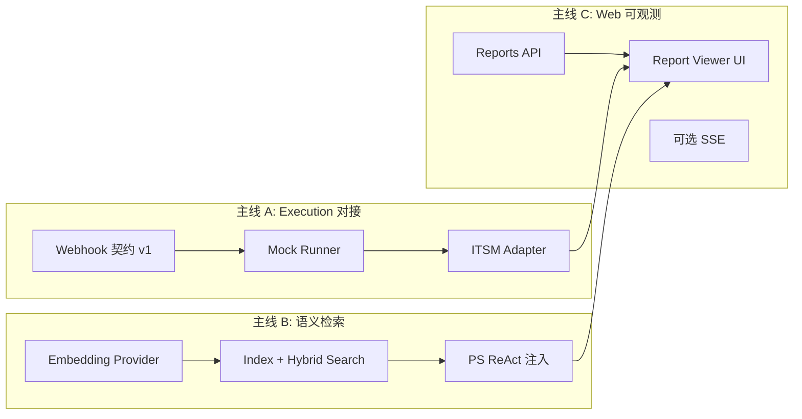

# Forge v1.2 规划（半自治 → 可对接）

> **前置条件**：路径 A 质量收口基本完成（W1 签收；W2 核心项已落地）。  
> **基线**：218 offline tests；三场景 LLM 全链路 compliant；`reports/llm_baseline/` 已归档。  
> **关联**：[PHASED_ROADMAP.md](PHASED_ROADMAP.md) · [PATH_A_QUALITY.md](PATH_A_QUALITY.md) 附录 C

---

## 一、v1.2 定位

| 维度 | v1.0 / v1.1（现状） | v1.2（目标） |
|------|---------------------|--------------|
| **执行** | simulate / local_manifest / 裸 webhook | **可对接** 1 个外部系统 POC（工单/变更单） |
| **知识** | 关键词 + tag + memory_graph 加权 | **embedding 语义检索** 注入 ProblemSolver |
| **接入** | CLI Rich Demo + `POST /solve` 同步 JSON | **Run Report 只读 Web** + 运行状态可浏览 |
| **审批** | CLI `--approve` / `--auto-approve` | Web 只读审批状态；**完整审批 UI 延 v1.3** |
| **刻度** | 验收 ~90%（路径 A） | **可对接演示**：外部系统收到任务 + 报告可分享 |

**一句话**：v1.2 不扩 Agent 域、不上 SkillRegistry；把 v1.1 的「半自治骨架」接到**一个真实边界**和**一个语义增强**。

---

## 二、范围边界

### 在 v1.2 内（P0）

1. **Execution Webhook POC** — 标准化 payload、签名、重试、对接文档 + mock server  
2. **ITSM 适配器（单系统）** — 推荐首选：**通用 webhook + Jira/禅道/飞书工单 三选一**（实现一个即可）  
3. **Embedding 检索** — 仅 `search_similar_cases` / ProblemSolver ReAct 注入；离线可降级  
4. **Web Run Report 查看器** — 读 `reports/` 与 `.forge_state/`；无登录 MVP  
5. **回归与文档** — LLM 引用率不降；offline tests 只增不减  

### 在 v1.2 内（P1，时间不够可延 v1.3）

- Web **SSE** 流水线进度（`/solve` 流式事件）  
- `memory_graph` **跨会话持久化**（独立 `memory/` 目录）  
- Compliance **闭环外** ReAct 全扫描策略固化（见 PATH_A W2-4）  

### 明确排除（v2.0）

- SkillRegistry、多 Rule Pack 域扩展  
- 向量库生产集群、多租户  
- 完整 Web 审批工作台（表单、RBAC、审计签章）  
- 真实 CMDB 双向同步、生产级 ITSM 编排  

---

## 三、三大主线与依赖



**建议并行**：A 与 B 可并行；C 在 A 有 manifest/webhook 样例后更易演示。

---

## 四、分 Sprint 任务表（6 周时间盒）

### Sprint 1（第 1–2 周）— Execution 契约 + Mock

| ID | 任务 | 关键路径 | DoD |
|----|------|----------|-----|
| E1-1 | Webhook 契约文档 | `docs/EXECUTION_WEBHOOK.md` | 请求/响应 JSON Schema、错误码、幂等 `task_id` |
| E1-2 | 增强 `execute_webhook` | `core/execution/backend.py` | 解析响应体 `results[]`；失败可重试 1 次；结构化 metadata |
| E1-3 | Mock webhook server | `scripts/mock_execution_webhook.py` | 本地 `python -m` 起服务；`test_execution_webhook.py` 绿 |
| E1-4 | local_manifest → webhook 对齐 | `backend.py` | 两种模式 payload 字段一致，便于切换 |
| E1-5 | CLI 演示 | `run.bat` + DEMO_SCRIPT | `--execution-mode webhook` 端到端 Demo 步骤 |

**Sprint 1 签收**：`FORGE_EXECUTION_WEBHOOK_URL=http://127.0.0.1:9xxx/hooks/forge` 跑通 security 场景，manifest 与 webhook 二选一可复现。

---

### Sprint 2（第 3 周）— ITSM 适配器（单系统 POC）

| ID | 任务 | 关键路径 | DoD |
|----|------|----------|-----|
| E2-1 | `ExecutionAdapter` 抽象 | `core/execution/adapters/base.py` | `submit(task) -> external_id`；`poll` 可选 |
| E2-2 | 实现 1 个适配器 | `adapters/jira.py` 或 `adapters/generic_rest.py` | 创建工单/变更单；映射 `task_type` → 模板 |
| E2-3 | 配置 | `.env.example`、`config.py` | `FORGE_ITSM_ADAPTER=generic` + URL/Token |
| E2-4 | 样例归档 | `reports/execution/` | 一次真实（或 sandbox）调用截图/JSON |

**推荐 POC 路径**：先做 **generic_rest**（POST 自定义 JSON），客户侧用现有集成平台转发；避免首 sprint 绑死 Jira API 版本。

---

### Sprint 3（第 4 周）— Embedding 语义检索

| ID | 任务 | 关键路径 | DoD |
|----|------|----------|-----|
| K3-1 | Embedding 配置 | `utils/embedding.py`、`config` | 复用 LLM provider 或 `sentence-transformers` 可选依赖 |
| K3-2 | 索引构建 | `utils/knowledge_index.py` | finalize / append 时更新向量；存 `data/kb_index/` |
| K3-3 | 混合检索 | `knowledge_memory.search_similar_cases` | `score = 0.6*semantic + 0.4*keyword`；无索引时原逻辑 |
| K3-4 | 可观测 | ProblemSolver log | `prior_cases` 含 `match_reason: semantic|keyword` |
| K3-5 | 测试 | `test_knowledge_embedding.py` | 离线 mock 向量；不依赖 API |

**Sprint 3 签收**：同一问题两次运行，第二次 ReAct 前 `prior_cases count≥1`（种子 KB 后）。

---

### Sprint 4（第 5 周）— Web Run Report 查看器

| ID | 任务 | 关键路径 | DoD |
|----|------|----------|-----|
| W4-1 | Reports API | `web/app.py` | `GET /reports`、`GET /reports/{id}` 读 md/json |
| W4-2 | 静态查看页 | `web/static/report.html` 或轻量模板 | 渲染决策链路、合规、refs；移动端可读 |
| W4-3 | 与 `/solve` 联动 | `SolveResponse` | 返回 `report_url` 字段 |
| W4-4 | 安全 | 文档说明 | 默认 bind 127.0.0.1；无写接口 |

**Sprint 4 签收**：浏览器打开 `http://127.0.0.1:8000/reports/w1-2_security_run` 可读样例报告。

---

### Sprint 5–6（第 6 周 + 缓冲）— 集成验收与 P1

| ID | 任务 | 优先级 | DoD |
|----|------|--------|-----|
| I5-1 | v1.2 端到端 Demo 脚本 | P0 | `docs/DEMO_SCRIPT_V12.md`：Webhook + 报告 URL + 语义案例 |
| I5-2 | LLM 回归 | P0 | 三场景引用率 ≥70%；耗时记录 |
| I5-3 | SSE 进度（可选） | P1 | `GET /solve/stream` 或 WebSocket 原型 |
| I5-4 | memory 持久化（可选） | P1 | `memory/graph.json` 跨 run 加载 |
| I5-5 | PHASED_ROADMAP 更新 | P0 | 阶段 3/4 v1.2 项勾选 |

---

## 五、v1.2 总 DoD（签收清单）

- [ ] Webhook POC：mock server + 契约文档 + 单测  
- [ ] 至少 1 个 ITSM/通用适配器可创建外部工单  
- [ ] ProblemSolver 语义检索可开关（`FORGE_EMBEDDING_ENABLED`）  
- [ ] Web 可浏览 `reports/` 下 Run Report  
- [ ] 端到端 Demo：security 场景 → webhook/manifest → 报告 URL  
- [ ] offline tests ≥218；LLM 4/4 仍绿  
- [ ] `reports/sample_v12_demo.md` 归档一次完整运行  

---

## 六、技术决策（待确认）

| 决策点 | 建议 | 备选 |
|--------|------|------|
| ITSM 首对接 | **generic_rest** webhook 转发 | Jira Cloud REST v3 |
| Embedding 模型 | 与 LLM 同厂商 embedding API | 本地 `bge-small-zh`（可选 extra） |
| 向量存储 | 本地 JSON/numpy 文件 | chromadb（v1.3） |
| Web 前端 | 服务端模板 + 少量 JS | 不引入 React 全栈 |
| 审批 UI | v1.2 只读状态 | v1.3 再做操作 |

---

## 七、风险与缓解

| 风险 | 影响 | 缓解 |
|------|------|------|
| 外部 ITSM API 不稳定 | POC 延期 | 先 mock + generic_rest；真实环境 sandbox |
| Embedding 成本/延迟 | ReAct 变慢 | 异步索引；检索 top-3；可关闭 |
| Web 范围膨胀 | 工期失控 | v1.2 只读报告；审批写操作一律 v1.3 |
| LLM 引用率下降 | 验收回退 | 每 Sprint 跑 `test_llm_reference_coverage` |

---

## 八、命令速查（规划态）

```powershell
# Sprint 1 目标
.\.venv\Scripts\python.exe scripts\mock_execution_webhook.py
$env:FORGE_EXECUTION_WEBHOOK_URL="http://127.0.0.1:8765/hooks/forge"
.\run.bat --type security --execution-mode webhook --auto-approve --no-feedback

# Sprint 3 目标（规划）
# $env:FORGE_EMBEDDING_ENABLED="1"
.\run.bat --type security --no-feedback

# Sprint 4 目标（规划）
.\.venv\Scripts\python.exe -m uvicorn web.app:app --reload
# 浏览器 /reports/...
```

---

## 九、与版本路线图关系

```text
v1.0  核心闭环 + Demo
v1.1  置信度 / 审批 / 执行后端（simulate|manifest|webhook）
v1.2  对接 1 系统 + 语义检索 + 报告 Web  ← 当前规划
v1.3  审批 Web UI + SSE + memory 持久化
v2.0  SkillRegistry + 多域 Rule Pack + 向量生产化
```

---

## 十、建议开工顺序（本周）

1. **E1-1 ~ E1-3**：Webhook 契约 + mock server（无外部依赖，1–2 天可闭环）  
2. **K3-1 ~ K3-3**：embedding 接口 + hybrid search（与 E 并行）  
3. **W4-1**：Reports API（只读，风险低）  
4. 更新 `PHASED_ROADMAP.md` 当前焦点为 v1.2 Sprint 1  

**需要产品侧确认的一项**：ITSM POC 优先对接 **Jira / 禅道 / 飞书 / 仅 generic webhook** 中的哪一个？
